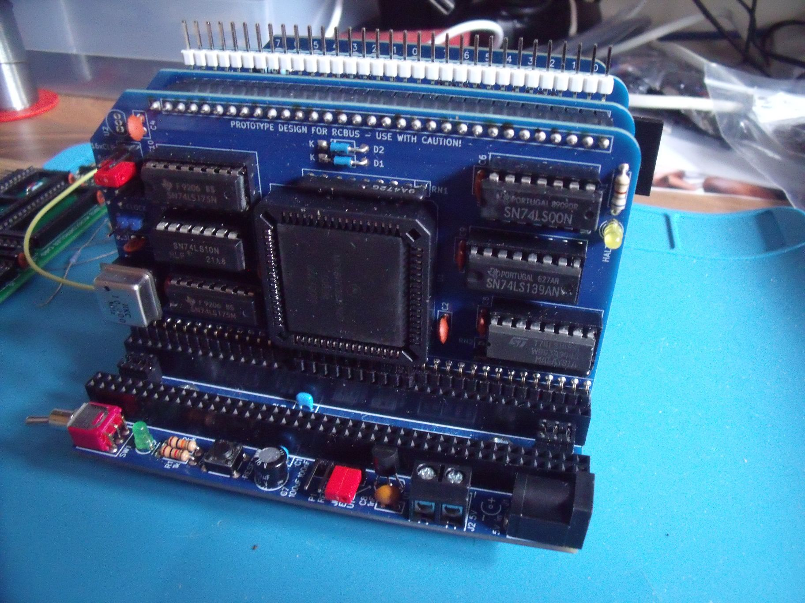
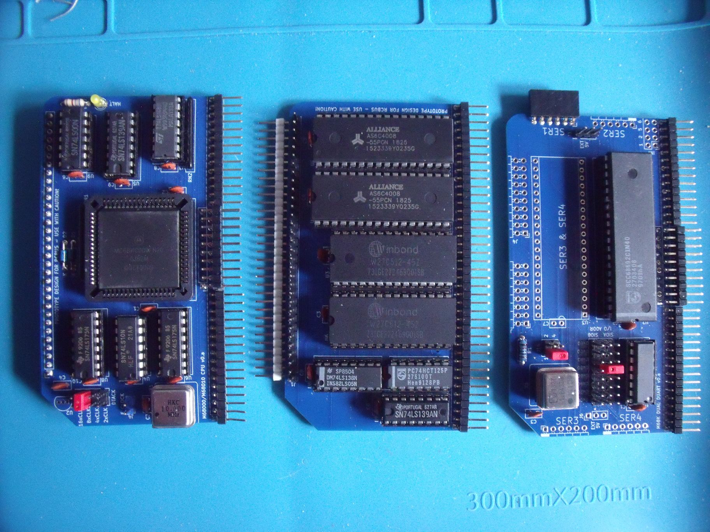

# RCBUS 68000 Board

This is my 68000 design for the RCBus. My design uses a 68000 microprocessor - not a 68008 - and is currently being tested on Steve Cousins [SC701](https://smallcomputercentral.com/rcbus/sc700-series/sc701-rcbus-backplane/) 6-slot RCBus backplane.

The initial design uses only the RCBus-40 pin connection and has a "private" connector between the 68000 board and the ROM/RAM board. This connector carries D8..D15, A17..A23, /AS, /UDS, /LDS, R/W, /DTACK & /RCBUS_DTACK as well as bunch of unassigned pins for use if needed during testing. However, I should have used a connector with longer pins. When the 2 boards are mated together, they are about 5mm closer together than the spacing of the SC701 backplane connectors which causes them to lean towards eachother.

The RCBus specification doesn't specifically mention the 68000 in the backplane signal assignments table so there may be a bit of wiggle room on the pins used. I will detail the RCBus 80-pin signal assignments once I have something more concrete - most likely once the next iteration of the boards gets produced as I will remove the private connector between the 68000 and the ROM/RAM board.

## Zilog compatability
There is no intention to support any Zilog specific chips such as the PIO, SIO, CTC or KIO as their signals and timing are just too different. The PIO and SIO have equivalents in the 68230 and 68681 chips. The KIO has a sort-of equivalent in the 68901. The CTC may not be needed as the 68230 and 68681 have their own timers.

## RCBus memory space

My 68000 design partially decodes blocks of memory within the 68000 address range as follows:
| Address Range | Signal |
| :---- | :---- |
| 0xE00000..0xEFFFFF | /MREQ goes low |
| 0xF00000..0xFFFFFF | /IORQ goes low |

The partial decoding of the RCBus memory space (0x0000..0xFFFF) results in address 0x0000 in RCBus memory space appearing multiple times (actually 16 times) in the 68000 address space at addresses 0xE00000, 0xE10000, 0xE20000 etc up to 0xEF0000.
  
The partial decoding of the RCBus I/O space (0x00..0xFF) results in address 0x00 in RCBus I/O space appearing multiple times (actualy 4096 times) in the 68000 address space at addresses 0xF00000, 0xF00100, 0xF002000 etc up to 0xFFFF00.

The current design places the SIO, PIO and MFP boards in RCBus I/O space and uses the fixed /DTACK generator on the processor card to signal completion of the cycle. The next iteration of boards will likely move these boards into a third memory space in the range 0xD00000..0xDFFFFF where the 68681, 68230 and 68901 will signal completion of a bus cycle using their own /DTACK signals.

## What works so far
Currently the following boards are completed and are under test:
* 68000 procesor card
* ROM / RAM card - 128K ROM & 1M RAM
* Quad serial I/O card - with 2 68681 DUARTs
* Multifunction card - with 2 68901s (not shown)

## To do
These boards are waiting to be populated and tested:
* Digital I/O card - with 2 68230 PI/Ts

## Progress
Currently the 68000 card, the ROM/RAM card and the serial I/O card are working and a small monitor program is running that allows me to download Motorola S-records. Both S2 & S3 record types are handled.

The monitor is currently being modified to support some of the EASy68K TRAP #15 text I/O functions.

The following RCBus cards have also been tested:
| Name | Description |
| :---- | :---- |
| [SC129](https://smallcomputercentral.com/rcbus/sc100-series/sc129-digital-i-o-rc2014/) | digital I/O module |
| [SC704](https://smallcomputercentral.com/rcbus/sc700-series/sc704-rcbus-i2c-bus-master/) | I2C bus master module |
| [SC406](https://smallcomputercentral.com/i2c-bus-modules/sc406-i2c-temperature-sensor-module/) | I2C temperature sensor module |
| [SC705](https://smallcomputercentral.com/rcbus/sc700-series/sc705-rcbus-serial-acia/) | serial ACIA module |

Further details available shortly once sufficient testing is done.

# Still to do
* Tidy up the monitor program
* Add EASy68K TRAP #15 support for a few text I/O functions
* Build and test the 68230 digital I/O card
* Firm up the RCBus-80 pin usage for the 68000
* Re-design boards to use the full RCBus-80 pin connectors (and remove private connector)
* Further testing with various RCBus boards I have
