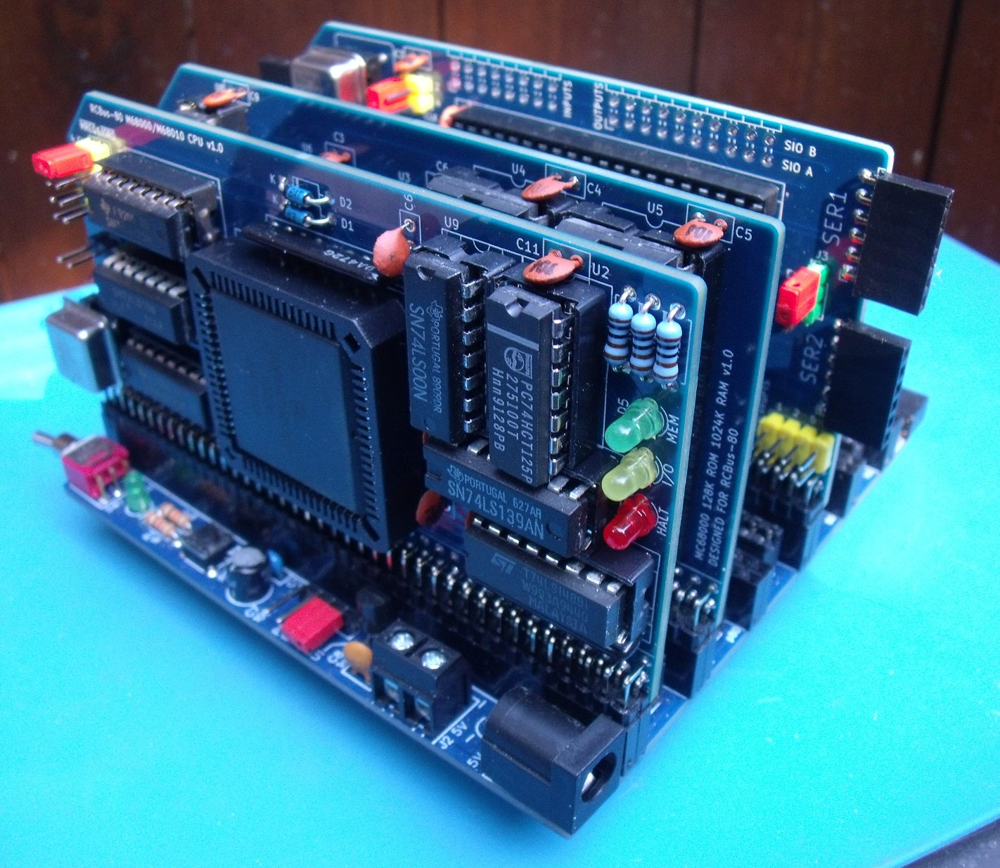

# RCBus Motorola 68xxx Project(s)

This repository is my attempt at introducing some of the Motorola MC68000 (and family) devices into the RCBus ecosystem. 

The image below is of my first RCBus-80 MC68000 system, comprising an MC68000 CPU board, ROM/RAM board and quad serial board.

Please note that this is my hobby project and I have no formal training in hardware design. There could be some real gotchas here.

# Table of contents
- [The RCBus](#the-rcbus)
- [Zilog Compatability](#zilog-compatability)
- [The Boards](#the-boards)
- [Address Map](#address-map)
- [RCBus Compatability](#rcbus-compatability)
- [Software Development](#software-development)
- [Hardware Library](#hardware-library)
- [Component Sourcing](#component-sourcing)

# The RCBus
RCBus is an extended version of the [RC2014&trade;](https://rc2014.co.uk/) bus that was put together by members of the [retro-comp](https://groups.google.com/g/retro-comp) google group. The latest RCBus specification as of Oct 2025 is v1.0 and can be found [here](https://smallcomputercentral.com/rcbus/).

My boards are designed around the RCBus 80 pin format in order to support the additional address and data signals.

# Zilog Compatability
There is no intention to support any Zilog specific chips such as the PIO, SIO, CTC or KIO as their signals and timing are just too different. The PIO and SIO have equivalents in the MC68230 and MC68681 chips. The KIO has a sort-of equivalent in the MC68901. A CTC chip may not be needed as the MC68230 and MC68681 have their own timers and the MC68901 has 4 simple timers.

# The Boards
The boards below are my current suite of MC68xxx processors and peripherals. I have re-organised and re-named the boards in order to more easily identify them.

There are currently 2 types of board, the series 1 boards that I've give the names RC1xx to and the series 2 boards that I've given the names RC2xx to.

There are no programable logic devices (PALs, GALs, CPLDs etc) in my series 1 designs. The only programmable devices are the 2 EEPROMs containing my own simple monitor program and optionally CP/M-68K v1.3 and EhBASIC.

My series 2 designs do use programmable logic - an Atmel ATF1502 or ATF1504 - on the processor cards. These devices were chosen as they are easy to program with a simple readily available FTDI USB-to-Serial board and open source software.
 
The board dimensions should be the size of an RCBus "medium" module as detailed in the RCBus specification v1.0 - roughly 4in x 2.1in excluding the edge connector. All the boards are 4-layer boards with +5V and GND on the inner 2 layers.

There are more details of each board in their respective boards folder.

## Series 1 Boards
These boards are based around my intial experimentation with an MC68000 ecosystem. The processor boards use autovectored interrupts and the various I/O boards don't support any form of interrupt acknowledge sequence.

| ID | Type | Description |
| :---- | :---- | :---- |
| RC101 | CPU | MC68000 CPU Board |
| RC102 | Memory | 128K ROM & 1M RAM Memory Board |
| RC103 | Serial | Dual MC68681 DUART Serial Board |
| RC104 | Parallel | Dual MC68230 PI/T Board |
| RC105 | Serial & Parallel | Dual MC68901 MFP Board |
| RC106 | CPU | MC68302 CPU Board |
| RC107 | Memory | 1M ROM & 1M RAM Memory Board |
| RC108 | SPI | Hybrid SPI Master Board* |
| RC109 | Serial & Parallel | MC68681 DUART & MC68901 MFP Board |
| RC110 | CPU | MC68020 CPU Board* |
| RC111 | Serial & Maths | MC68681 DUART & MC68881 Maths* |

* These boards are either under development or going through basic testing. Once I'm confident in the board operation, I will put the design files into the boards folder.

## Series 2 Boards
These boards are based on my expereince with the earlier series 1 boards and are an attempt to introduce vectored interrupts to the boards that use chips such as the MC68681 DUART or the MC68230 PIO. The introduction of vectored interrupts requires additional interrupt acknowledge signals on the RCBus-80 backplane. In order to not run out of pins, I have chosen to use IRQ2, IRQ3, IRQ5 and IRQ6 as vectored interrupts, leaving IRQ1, IRQ4 and IRQ7 as autovectored interrupts. 

Supporting vectored interrupts requires additional logic on the processor board which in turn requires additional board space which is in very short supply. I wanted to avoid programmable logic but it became clear that that wasn't going to be an option. I spent a bit of time researching before I settled on using Atmel (now Microchip) ATF1502 CPLD devices in a 44-pin PLCC package. I chose these devices as it appears that they can be programmed using nothing more complex than one of the FTDI USB-Serial boards and open source software.

| ID | Type | Description |
| :---- | :---- | :---- |
| RC201 | CPU | MC68000 CPU Board |
| RC202 | Serial | MC68681 DUART Serial Board (inc bit-bang SPI, I2C & 1-Wire) |
| RC203 | Parallel | Dual MC68230 PI/T Board |

These boards are on the desk waiting to be populated to check out the feasibility of vectored interrupts. I've put some very basic details in the boards folder for now.

# Address Map
The current address map is as follows:

| Address Range | Device | Notes |
| :---- | :---- | :---- |
| 0x000000..0x01FFFF | EEPROM | Fixed address range1 |
| 0x100000..0x1FFFFF | SRAM | Fixed address range1 |
| 0x000000..0x5FFFFF | FLASH | Jumper selectable address range2 |
| 0x000000..0x5FFFFF | SRAM | Jumper selectable address range2 |
| 0xD00000..0xD03FFF | DUARTs | Jumper selectable address range 5|
| 0xD00000..0xD03FFF | LBE | Jumper selectable address range 5|
| 0xD00000..0xD03FFF | DUART + MATH | Jumper selectable address range 5|
| 0xD08000..0xD0BFFF | PI/Ts | Jumper selectable address range |
| 0xD10000..0xD13FFF | MFPs | Jumper selectable address range |
| 0xD20000..0xD23FFF | SPI | Fixed address range |
| 0xF00000..0xF7FFFF | RCBus /MREQ | Fixed address range3 - partially decoded |
| 0xF80000..0xFFFFFF | RCBus /IORQ | Fixed address range3 - partially decoded |
| 0xFC0000..0xFCFFFF | RCBus /MREQ | Fixed address range4 |
| 0xFD0000..0xFDFFFF | RCBus /IORQ | Fixed address range4 - partially decoded |

1. These addresses apply to the ROM/RAM V1 board
2. These addresses apply to the ROM/RAM V2 board
3. These addresses apply to the MC68000 board
4. These addresses apply to the MC68302 board
5. These boards share the same address range so that the same monitor code can be used with the MC68681 DUARTs on each of the boards.

Note: When using the MC68302 CPU board and a modified ROM/RAM board, the ROM devices will initially be mapped to address 0x000000 and selected with the chip select signal /CS0. The MC68302 can then remap /CS0 (and /CS1 for the RAM devices) to an alternate location in the address space. 

# RCBus Compatability
I have a number of Steve Cousin's RC2014&trade; / RCBus boards that I have been able to use successfully in the 68000 system. The code folder holds some example code for these boards as well as CP/M-68K v1.3 using the CompactFlash storage.

| Name | Description |
| :---- | :---- |
| [SC129](https://smallcomputercentral.com/rcbus/sc100-series/sc129-digital-i-o-rc2014/) | digital I/O module |
| [SC145](https://smallcomputercentral.com/rcbus/sc100-series/sc145-compact-flash-rc2014/) | CompactFlash module |
| [SC611](https://smallcomputercentral.com/rcbus/sc600-series/sc611-rcbus-micro-sd/) | MicroSD module |
| [SC704](https://smallcomputercentral.com/rcbus/sc700-series/sc704-rcbus-i2c-bus-master/) | I2C bus master module |
| [SC406](https://smallcomputercentral.com/i2c-bus-modules/sc406-i2c-temperature-sensor-module/) | I2C temperature sensor module |
| [SC705](https://smallcomputercentral.com/rcbus/sc700-series/sc705-rcbus-serial-acia/) | serial ACIA module |
| [SC729](https://smallcomputercentral.com/rcbus/sc700-series/sc729-rcbus-compact-flash-module/) | CompactFlash module |

The SC145 & SC729 CompactFlash modules have both been tested with CP/M-68K v1.3 and appear to operate correctly.

I've ported part of J B Langston's [TMS9918A code](https://github.com/jblang/TMS9918A/tree/master) to work with Shiela Dixon's [TMSEMU RCBus video card](https://peacockmedia.software/RC2014/TMSEMU/). There are now several demos working as I've slowly added more functionality to the TMS library. Some demos have also been ported from assembler to C along with modifications to the library to support C function calls.

I've also had success in porting some of Dean Netherton's [HDMI for RC](https://www.dinoboards.com.au/hdmi-for-rc) (V9958A) demonstration code. There are now several demos working as I've slowly explored his Tang Nano 20K FPGA emulation of a V9958A chip.

# Software Development
All of the early software - i.e. the monitor program - was developed and initially tested using EASy68K & SIM68K under Windows 10.

I moved my development across to a Linux Mint system for a few months but eventually the number of niggles became too much and I've now moved to a Windows 11 system.

I've left the command line version of the EASy68K assembler in another repository as that runs just fine from a Linux command prompt. I made a few tweaks and corrections and you can find it in a separate repository called EASy68K-asm.

Unfortunately I've had little success in building Newlib or similar libraries to create a libc for my system. This is purely down to my lack of experience / understanding of the configuration and build process. I've therefore resorted to rolling my own libc using the code detailed in [The Standard C Library by P.J.Plauger](https://www.amazon.co.uk/Standard-C-Library-P-J-Plauger/dp/0131315099) as a starting point. 

# Hardware Library
I'm not a C++ programmer so I figured I would try and learn about C++ and classes and decided to throw myself in at the deep end - the really deep end!

Having returned to the world of microcontrollers by playing around with some Arduino UNO boards, I figured that I might try and create some hardware libraries in the style of Arduino.

Currently I have a serial port library that provides similar functionality to some of the functions in the [Arduino Serial class](https://docs.arduino.cc/language-reference/en/functions/communication/serial/) that supports the dual MC68681 SIO board.

# Component Sourcing
Whilst many of the TTL logic devices are generally still available as NOS (New Old Stock), almost all the larger chips (CPUs, DUARTS etc) are now obsolete and can be difficult to locate. Here in the UK my sources are either [Silicon Ark](https://www.silicon-ark.co.uk/) or ebay.

I've also used AliExpress but a note of caution. It has been my experience that quite a few sellers on AliExpress are claiming that their chips are new devices. In reality these devices have most likely been reclaimed from old scrapped boards and have solder on their pins. My experience with these devices is that they do work as they should but the presence of the solder makes their pins 'sticky'. After several insertions and removals, either the IC socket breaks or a pin breaks off the device. For me, this was particually the case when using EEPROM or FLASH devices and going through the early burn and learn programming process.

