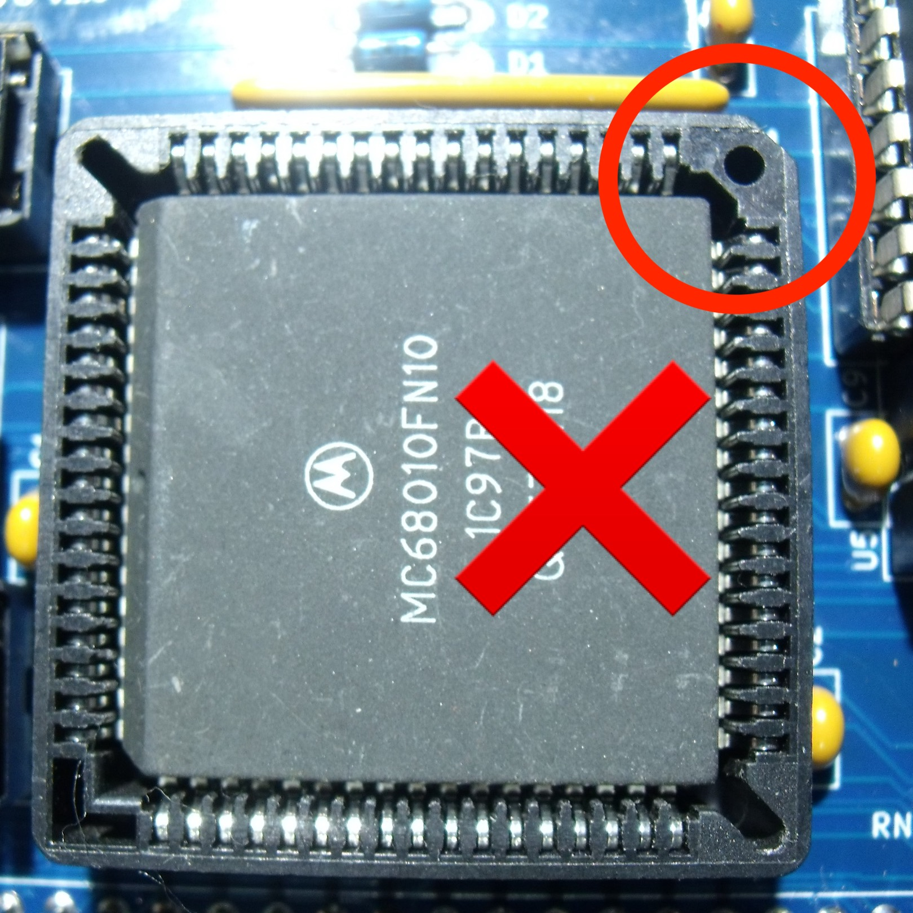
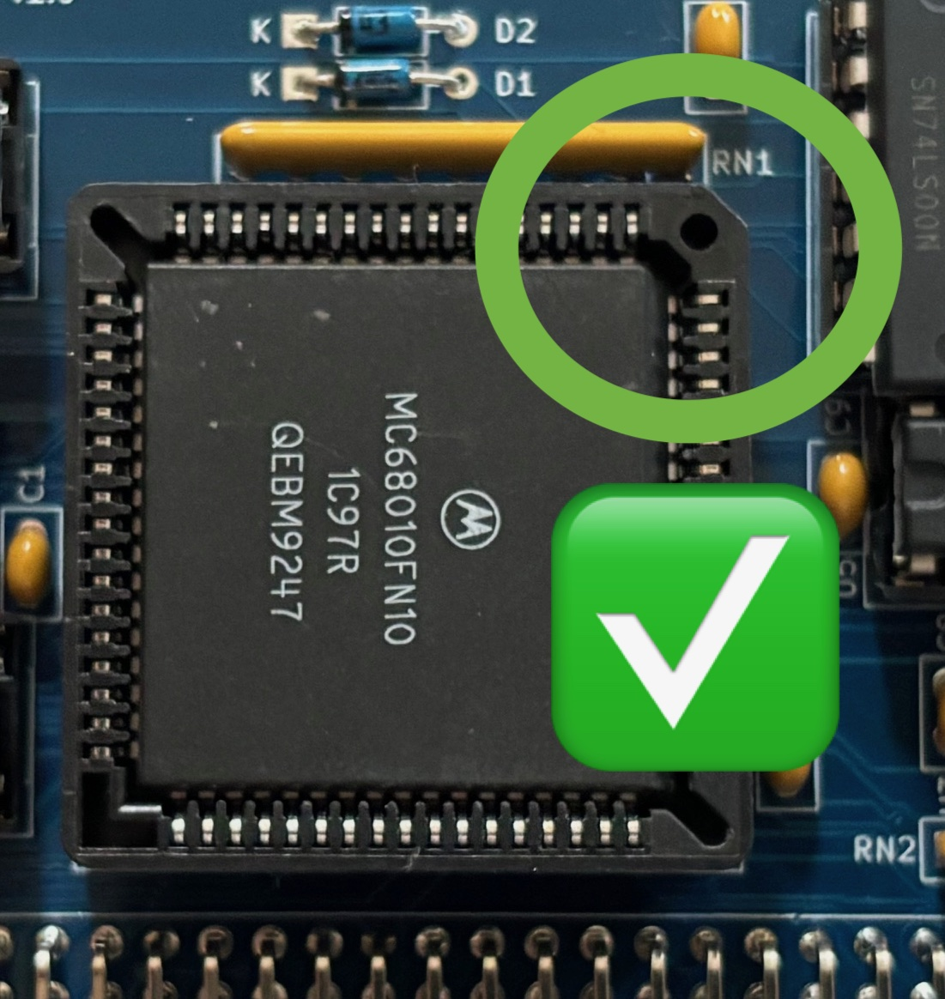

# 68000 Processor Board
The processor board consists of a PLCC packaged MC68000 processor, bits of glue logic and the processor clock source. A 68010 processor can also be used but the current monitor program doesn't make use of the vector base register at the moment.

# Details
The processor board is designed to plug into an RCBus-80 backplane and expects to find the stack pointer and initial program counter addresses at location 0x000000 onwards. There is no fancy ROM & RAM switching hardware so ROM is always located at address 0x000000.

## Reset
The reset signal for the processor board must be supplied externally, entering the board via pin 20 of the RCBus connector. This should not be an issue if you are using one of Steve Cousins's backplanes.

## Processor Clock
The processor/system clock source is an oscillator in an 8-pin DIL/DIP can (X1 in the schematic). I used a turned pin socket to hold the oscillator as it made it easy to quickly swap in and out oscillators of different frequencies. Basic testing was done with a 7.3728MHz oscillator. An 18.432MHz oscillator was also tried and CP/M-68K appeared to work correctly with no issues accessing the CompactFlash drive. 

There's also a jumper (J4) to allow the processor E clock to be routed onto the RCBus CLOCK2 pin (61) if required. However, note that the CLOCK2 pin may also be used by the serial, parallel and multifunction boards (via jumpers on their boards) to share a clock source between them - usually to feed the baud rate generators and timers. If this feature is used, then the E clock jumper **must not** be fitted.

## DTACK & Bus Error
The processor board includes a counter to generate a bus error if a /DTACK is not received after 4 clocks of the E signal.

The processor board also includes a counter to generate a /DTACK for the RCBus MREQ and IORQ addresses. The /DTACK delay can currently be set to 1, 2, 3 or 4 system clocks.

Only RCBus /MREQ and /IORQ accesses generate a /DTACK. All other boards must supply their own /DTACK signal otherwise a bus error will be raised.

## RCBus Signals
The RCBus specification (v1.0) doesn't specifically mention the 68000 in the backplane signal assignments table so there's a bit of wiggle room on the pins used.

I've stuck to the same signals for pins 1-40. The M1 signal isn't used and should have a 4K7 pullup resistor (manually added as I forgot it in my release 2.0 board!) and the USER1..USER4 which are used for the level 1, 3, 5 & 6 autovector interrupts.

Pins 41-80 carry D8..D15 as well as the higher address bits. Pins 41..44 have been used to carry some 68000 specific signals.

The current signal list is in the RCBus 68000 Pinout PDF file.

## RCBus Memory Space
My 68000 design partially decodes 2 blocks of memory within the 68000 address range as follows:
| Address Range | Signal |
| :---- | :---- |
| 0xF00000..0xF7FFFF | /MREQ goes low |
| 0xF80000..0xFFFFFF | /IORQ goes low |

This partial decoding results in the RCBus I/O and memory spaces appearing multiple times within the 68000 address range. A /DTACK signal is generated on the processor card for any access to the RCBus whether there is a device present at that address or not.

For both I/O and memory spaces, consecutive memory locations are accessed on the ODD bytes such that I/O address 0x00 is accessed at address 0xF80001, address 0x01 is accessed at address 0xF80003 etc.

## Onboard LEDs
There were a few gates left over and I've used them to drive activity LEDs for accesses to the RCBus I/O and memory spaces as well as a HALT LED. Note that the I/O and MEM LEDs will only glow faintly.

# Board Assembly
Assembly of the board should be fairly straightforward. There are no surface mount devices to deal with.

Depending on your choice of LED colour, the associated current limiting resistor may need to be altered.

If you choose have a turned pin socket for the system clock, then an 8-pin DIL surned pin socket can be used. I flipped the socket over - so pins pointing upwards - and easily pushed out pins 2,3,6 & 7.
 
ICs are orientated in different directions - make sure you insert the chips into their sockets in the correct orientation. Also pay attention to the orientation of the 68000 processor - see note below. 

When fitting the 80-pin right angle connector, initially only solder a couple of pins at opposite ends of the connector so that you can make any adjustments if the board is not vertical when fitted to the backplane.

# Software
I've written a very simple monitor program for the 68000 board whick can be found in the ASM_CODE folder - called MON68K. The monitor was initially developed using EASy68K.

MON68K assumes that an SIO board is present and that one of the DUART chips is at address 0xD00000 (CS0 on the SIO board). If this is not the case, then the processor board will generate a bus error and stop in an endless loop.

## Interrupts
As the ROM is fixed at address 0x000000, the exception vector table addresses are also fixed. Exception vectors up to and including TRAP #15 each call their own handler stub within the monitor ROM. The remaining exception vectors are all directed to a single handler as they are not used within my design - i.e. vectored interrupts are not supported, only autovectored interrupts.

Each exception handler stub in the ROM (apart from bus error, address error and TRAP #15) looks up the start address of the actual exception handler code in a table of addresses held in RAM (which is initialised by the montor program). The table is located at the start of RAM occupying addresses 0x100000..0x1003FF and is laid out just like a normal exception vector table.

In order to use your own exception handler, you simply over write the RAM exception vector table entry with the address of your own handler.

A 68010 processor can also be used but the current monitor program doesn't make use of the vector base register at the moment.

# Jumpers
+ J1: DTACK delay of 1,2,3 or 4 clocks for the RCBus memory (MREQ) and I/O (IORQ) address spaces.
+ J4: Fit jumper to output the CPU E clock onto RCBus CLOCK2. Only fit this jumper if you are not using CLOCK2 to share clocks between the SIO, PIO & MFP boards. 

# Caution
+ CPU Insertion
  + Make sure you orientate the CPU the correct way. It can be easy to miss the notches on CPU and sockets
    
    

# Errors
+ MREQ & IORQ Activity LEDs - The silkscreen labels I/O & MEM are the wrong way round!
+ Missing 4K7 pullup on the M1 signal - wire link M1 to a spare pin on RN1.

# To Do
+ Experiment to find the maximum width of board that JLCPCB will accept to keep the low price.
+ Modify the RCBus80 medium board footprint in Kicad so that pins 1,40,41 & 80 don't throw DRC warnings/errors.

