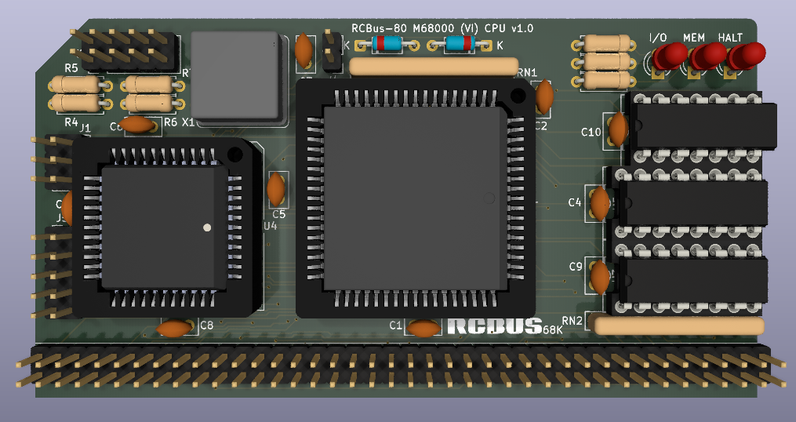

# 68000 Processor Board (Series 2)

Still at the prototyping stage so just a 3D render at the moment.

# Details
This is a 3D render of my new 68000 CPU board that will hopefully support a mixture of vectored and autovectored interrupts. I have the bare board on the bench and am slowly starting to populate it starting with the ATF1502 CPLD device and learning along the way how to program it and use WinCUPL2 at the same time.

This is very much a prototype at the moment and I need to see if it is actually works in practice.

