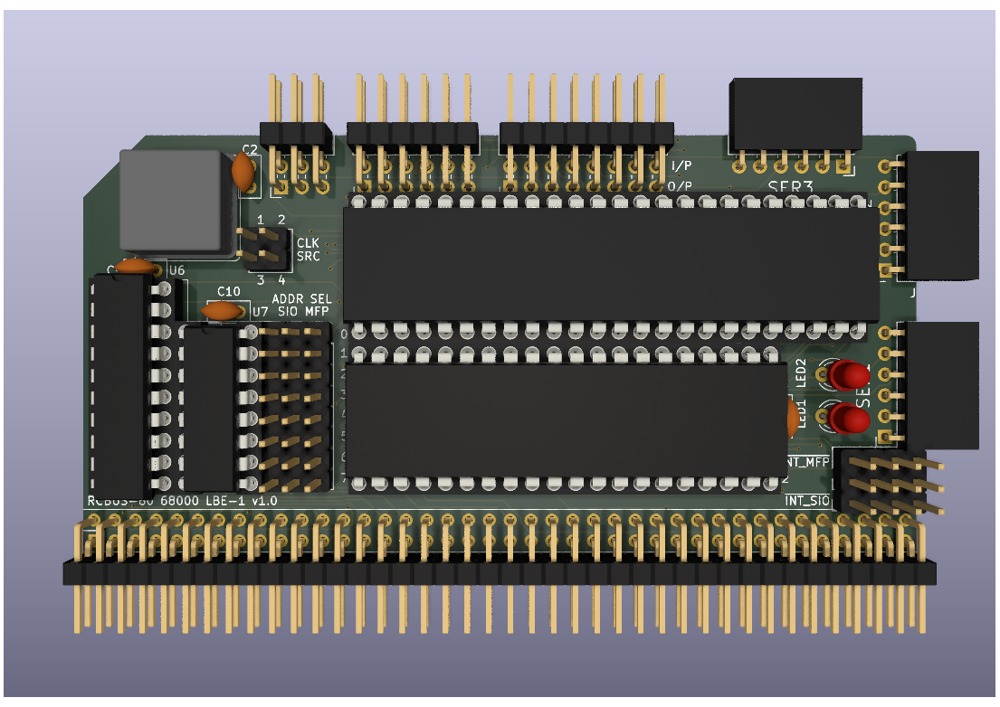

# 68000 LBE (Little Bit of Everything) Board
Still at the design stage so just a 3D render at the moment.

# Details
The intention of this board was to try and make a 68000 equivalent of Steve Cousins Z80 [SC110 board](https://smallcomputercentral.com/rcbus/sc100-series/sc110-z80-serial-rc2014-3/) which consists of a Z80 SIO/2 serial chip and a Z80 CTC counter timer chip.

By combining an MC68681 DUART with an MC68901 MFP I managed to achieve a similar board, but with more functionality - mainly due to the MC68901.

The MC68681 gave me:
+ 2 Serial Ports
+ 8 Digital Outputs
+ 6 Digital Inputs
+ 1 24-bit Timer

The MC68901 gave me:
+ 1 Serial Port
+ 8 Digital Inputs/Outputs
+ 4 8-bit Timers

The design provides serial I/O, digital I/O and some timers so the name Little Bit of Everything seemed appropriate.

This is very much a design concept at the moment and I need to determine if it is actually useable in practice.

