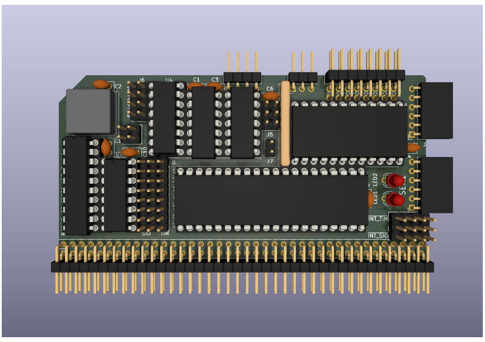

# 68000 LBE (Little Bit of Everything) Board #2
Still at the prototyping stage waiting for the boards to be delivered so just a 3D render at the moment.

# Details
The intention of this board was to try and make a 68000 equivalent of Steve Cousins Z80 [SC110 board](https://smallcomputercentral.com/rcbus/sc100-series/sc110-z80-serial-rc2014-3/) which consists of a Z80 SIO/2 serial chip and a Z80 CTC counter timer chip.

I knew that there would  be limitations with my LBE #1 board. The serial port within the MC68901 is pretty slow and the 68901 chip takes up a fair amount of board space for what it does.

As an alternative design, I put together this board that combines an MC68681 DUART with an 8254-2 Counter/Timer.

The MC68681 gave me:
+ 2 Serial Ports
+ 8 Digital Outputs
+ 6 Digital Inputs
+ 1 16-bit Timer

The 8254-2 gave me:
+ 3 16-bit Timers

The design provides serial I/O, digital I/O and 4 16-bit timers.

The X2 pin of the MC68681 has a solder jumper so that this pin can be grounded if required. This should allow a greater choice of MC68681 alternatives to be fitted.

The 8254-2 requires its own DTACK circuitry using a 74LS175 and a 74LS125. With the spare gates on the 74LS125 I have managed to add in a bit banged I2C port. Time will tell if this particular feature is viable or not.

This is very much a design concept at the moment and I need to determine if it is actually useable in practice.

