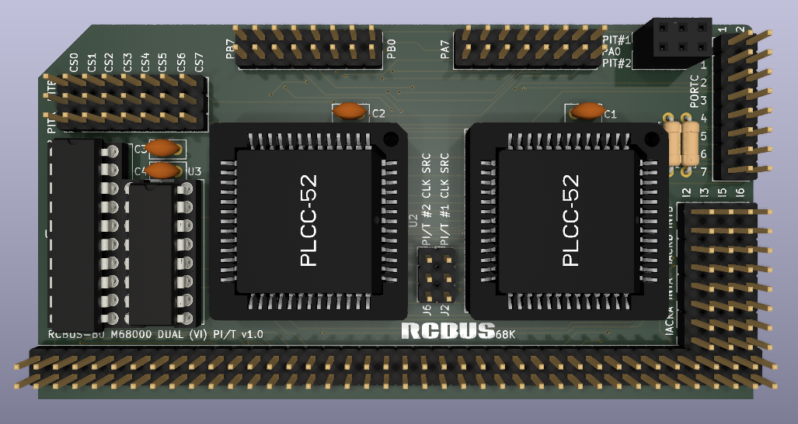

# 68230 Parallel I/O Board (Series 2)

Still at the prototyping stage so just a 3D render at the moment.

# Details
This is a 3D render of my new 68230 parallel I/O board that will hopefully support vectored interrupts. I have the bare board on the bench ready to populate and test once I get the new 68000 board working.

This is very much a prototype at the moment and I need to see if it is actually works in practice.

