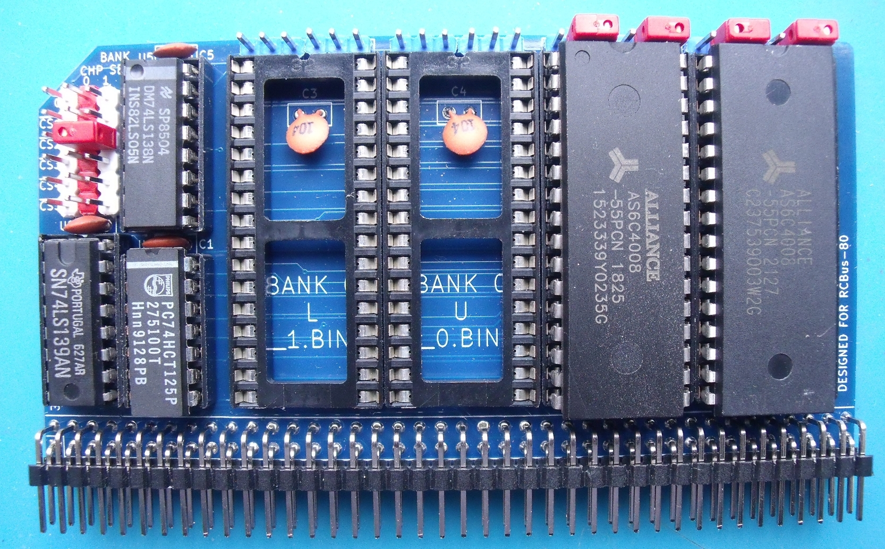

# Notes
Do not mix ROM & RAM chips in the same bank.

# Jumpers
+ J10: Memory Address selection
  + 000000 .. 0FFFFF
  + 100000 .. 1FFFFF
  + 200000 .. 2FFFFF
  + 300000 .. 3FFFFF
  + 400000 .. 4FFFFF
  + 500000 .. 5FFFFF
+ J11 (with J10): Specify the memory address for bank #0
+ J12 (with J10): Specify the memory address for bank #1

+ BANK #0
  + FLASH ROM chips installed
    + J6: Jumper pins 2-3
    + J7: Jumper pins 1-2
    + J8: Jumper pins 2-3
    + J9: Jumper pins 1-2
  + RAM chips installed
    + J6: Jumper pins 1-2
    + J7: Jumper pins 2-3
    + J8: Jumper pins 1-2
    + J9: Jumper pins 2-3
+ BANK #1
  + FLASH ROM chips installed
    + J3: Jumper pins 2-3
    + J2: Jumper pins 1-2
    + J5: Jumper pins 2-3
    + J4: Jumper pins 1-2
  + RAM chips installed
    + J3: Jumper pins 1-2
    + J2: Jumper pins 2-3
    + J5: Jumper pins 1-2
    + J4: Jumper pins 2-3

# Errors
+ The signals /RAM_CS and /ROM_CS don't go anywhere!
  + /RAM_CS should be called /CS_BANK0 & /ROM_CS should be called /CS_BANK1
    + Fix by connecting LS125 pin 1 to either pin 22 of bank 1 ICs & adding a 10K pullup resistor.
    + Fix by connecting LS125 pin 4 to either pin 22 of bank 2 ICs & adding a 10K pullup resistor.
+ J4 & J5 at the top of U7 are not on a 0.1in pitch.

