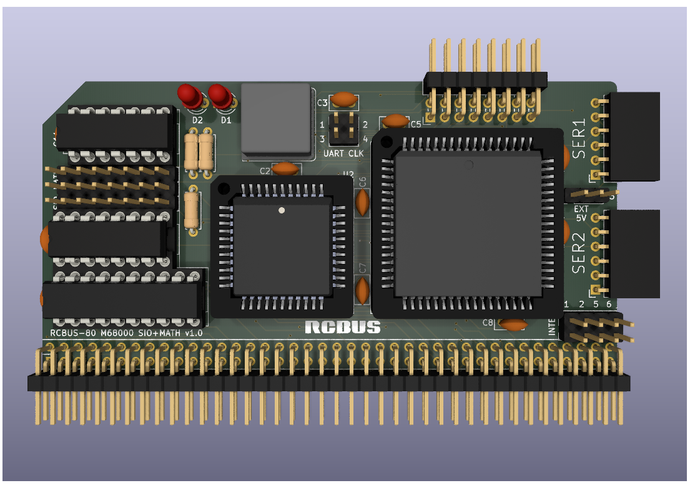

# Serial I/O & Maths Coprocessor Board

Still at the prototyping stage so just a 3D render at the moment.

# Details
This is a 3D render of my SCC68692 serial I/O and MC68881 (or MC68882) maths coprocessor board. It's still at the design stage.

The SCC68692 is a replacement for the MC68681 that supports 115200 baud serial communications.

The MC68881 (or MC68882) is connected to the MC68000 or MC68302 as a memory mapped peripheral.

This is very much a prototype at the moment and I need to see if it is actually useable in practice.

