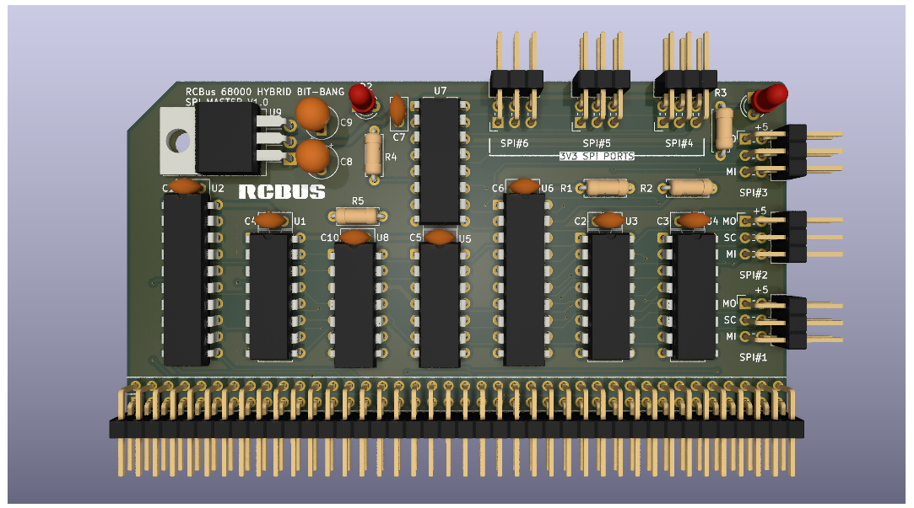

# Hybrid Bit-Bang SPI Master Board

# Details
This is a 3D render of my hybrid bit-bang SPI master board that I am slowly testing and ironing out design issues.

I'm calling it a hybrid bit-bang board but the serial to parallel and parallel to serial conversions are both done in hardware. The only bit-bang is the pulses to generate the SPI clock signal. These should easily be generated in a tight loop to get a somewhat fater interface than a traditional fully bit-banged SPI interface. By generating the clock signal this way, the clock can be slowed down (if needed) for those SIP devices that require a slower clock during initialisation.

The board supports 6 SPI connections - three are 5V SPI and three are 3v3 SPI - along with a 5v to 3v3 regulator.

This is very much a prototype at the moment and I need to see if it is actually useable in practice.

