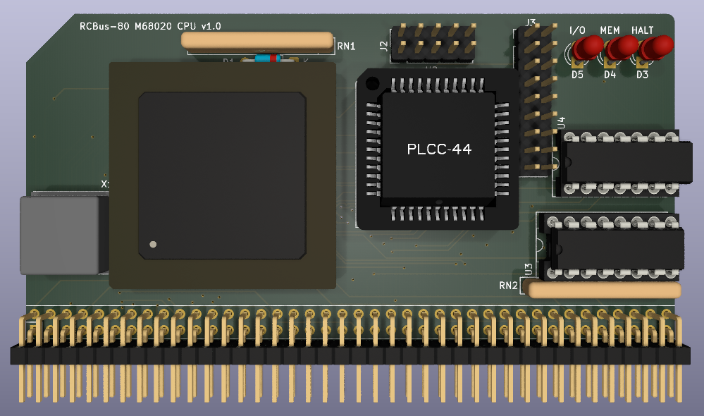

# 68020 Processor Board

Still at the prototyping stage so just a 3D render at the moment.

# Details
This is a 3D render of my new 68020 processor board. It's still very early in the design and it should have similar functions as the series 1 68000 board.

This is very much a prototype at the moment and I need to see if I can get the CPLD logic design correct so that it is actually works in practice.

