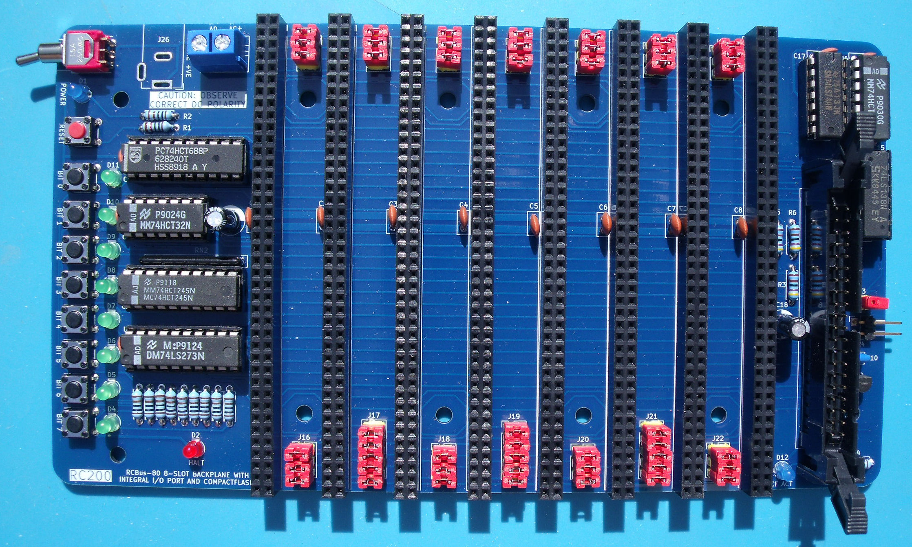

# RCBus-80 Backplane

# Details
This is my offering of an RCBus-80 backplane. In the past I have used Steve Cousins SC701 6-slot backplanes for my boards. However, I found that at 6 slots, I might run out slots.

I had a chat with Steve to get his approval for me to take his SC701 backplane design and alter it for my own needs.

This backplane I've put together has 2 additional slots - making 8 in total. It also incorporates parts of Steve's SC719 digital I/O board to give 8 debug LEDs and 8 tactile pushbuttons. I also incorporated his SC729 CompactFlash module (with electronics by Tadeusz Pycio - www.vtsys.pl) as well.

The downside is that there is no expansion RCBus-80 connector to extend the bus further.

As well as combining Steve's SC701, SC719 and SC729 into one board, I've also added an LED driven by the /HALT signal buffered by one of the spare 74LS32 OR gates.

**NOTE** There is no voltage regulator on this board - an externally regulated 5V supply is required. Further, there is **NO** reverse polarity protection so check your power supply polarity.

# Board Assembly
Assembly of the board should be fairly straightforward. There are no surface mount devices to deal with.

Depending on your choice of LED colours, the associated current limiting resistor may need to be altered to give visually similar brightnesses.

# CompactFlash Adapter Header
The 2x20 header for the CompactFlash adapter can be a standard 2x20 0.1in (2.54mm) pin header or you can use a 2x20 shrouded IDC connector with ejector levers. The latter provides keying to avoid inserting the CompactFlash adapter the wrong way round and ejector levers to avoid bending pins.

# Jumpers
I have tried to replicate the jumper configurations that Steve provides on his SC701 so please refer to his documentation.

# Future Enhancements
+ Connect backplane D8..D15 to D8..D15 of the CompactFlash adapter to potentially allow for 16-bit data transfers.

# Errors
None so far.

# History
+ v1.0 - initial design
