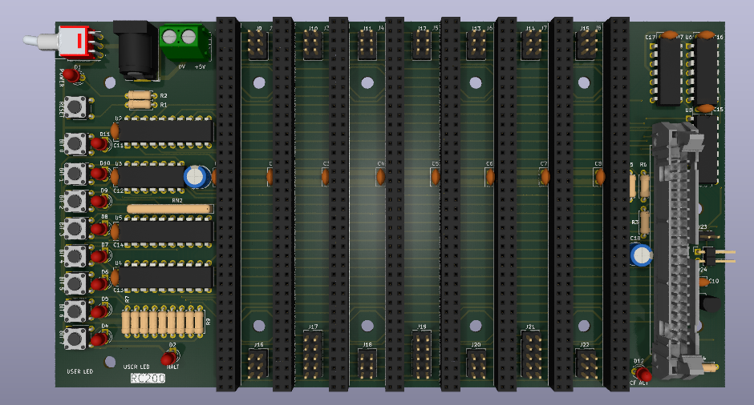

# RCBus-80 Developers Backplane

Still at the prototyping stage so just a 3D render at the moment.

# Details
This is a 3D render of a RCBus-80 backplane that I've been working on. In the past I have used Steve Cousins SC701 6-slot  backplanes for my boards. However, I found that at 6 slots, I might run out slots. A 12 slot board would be too big for my bench and I don't have the psychological strength to contemplate soldering 12 80-pin connectors.

I had a chat with Steve to get his approval for me to take his SC701 backplane design and alter it for my own needs.

This backplane I've put together has 2 additional slots - making 8 in total. It also incorporates parts of Steve's SC129 digital I/O board to give 8 debug LEDs and 8 tactile pushbuttons. I also incorporated his SC729 CompactFlash module as well.

The downside is that there is no expansion RCBus-80 connector to extend the bus further.

This is very much a prototype at the moment and I need to see if it is actually works in practice.

