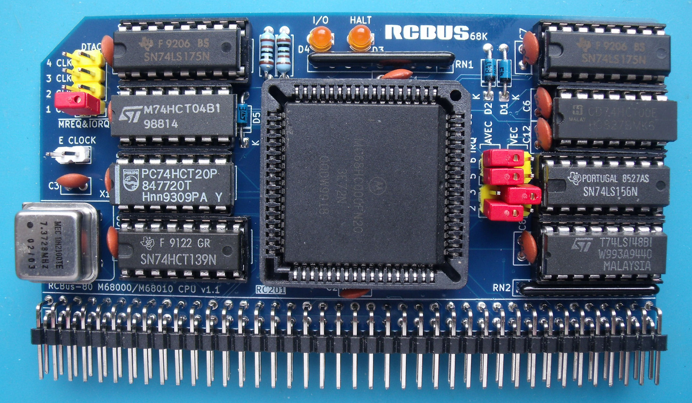
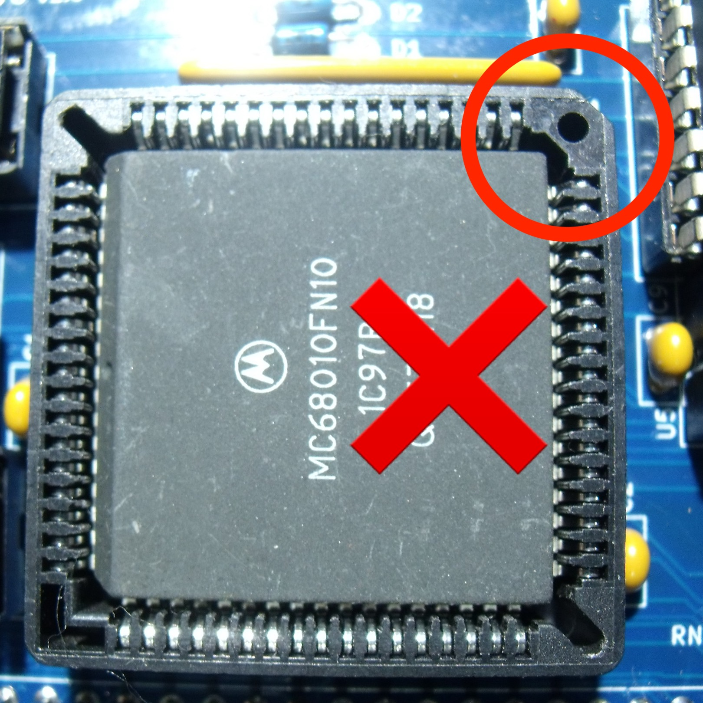
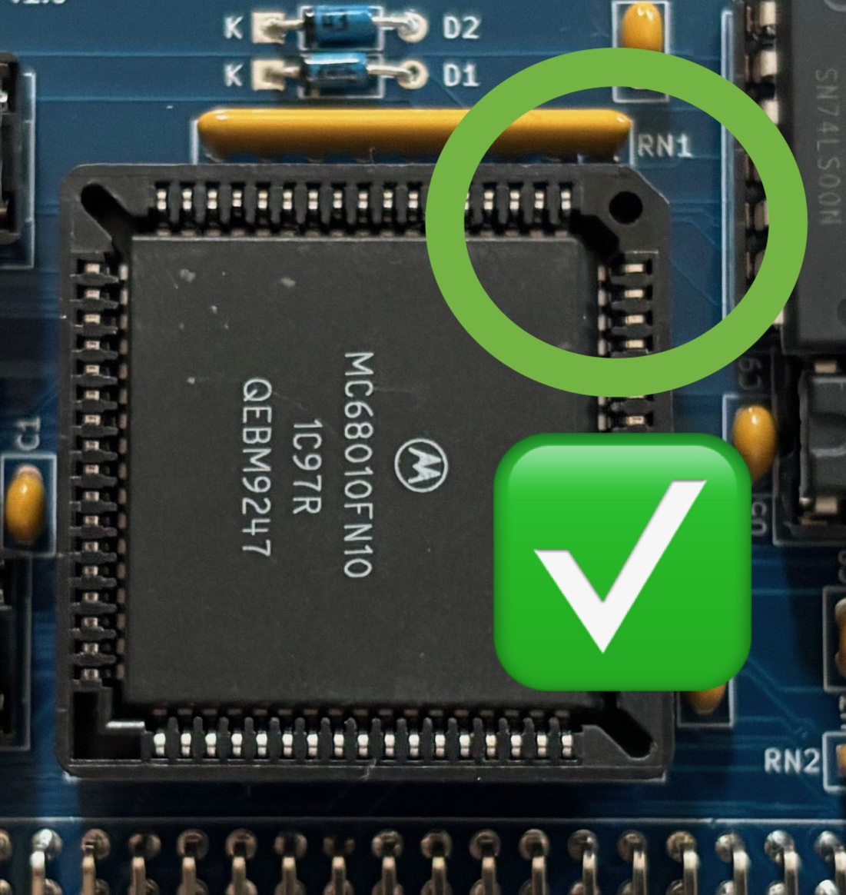

# RC201 - 68000 Processor Board

Actual image of the processor board under test with IRQ2, IRQ5 and IRQ6 configured for autovectored interrupts and IRQ3 for vectored interrupts.

# Details
The processor board consists of a PLCC packaged MC68000 processor, bits of glue logic and the processor clock source. A 68010 processor can also be used but the current monitor program doesn't make use of the vector base register at the moment.

The processor board is designed to plug into an RCBus-80 backplane and expects to find the stack pointer and initial program counter addresses at location 0x000000 onwards.

## Reset
The reset signal for the processor board must be supplied externally, entering the board via pin 20 of the RCBus connector. This should not be an issue if you are using one of Steve Cousins's backplanes.

## Processor Clock
The processor/system clock source is an oscillator in an 8-pin DIL/DIP can (X1 in the schematic). Basic testing was done with a 7.3728MHz oscillator. 

There's also a jumper (J4) to allow the processor E clock to be routed onto the RCBus CLOCK2 pin (61) if required. However, note that the CLOCK2 pin may also be used by other boards such as the RC202 serial board (to share its 3.6864MHz UART clock). If this feature is used, then the E clock jumper **must not** be fitted.

## DTACK & Bus Error
The processor board includes a counter to generate a bus error if a /DTACK is not received after 4 clocks of the E signal.

The processor board also includes a counter to generate a /DTACK for the RCBus MREQ and IORQ addresses. The /DTACK delay can currently be set to 1, 2, 3 or 4 system clocks.

Only RCBus /MREQ and /IORQ accesses generate a /DTACK. All other boards must supply their own /DTACK signal otherwise a bus error will be raised.

## RCBus Signals
The RCBus specification (v1.0) doesn't specifically mention the 68000 in the backplane signal assignments table so there's a bit of wiggle room on the pins used.

I've stuck to the same signals for most of the RCBus-80 pins with the following deviations:
| Pin(s) | Details |
| :---- | :---- |
| 1..16 | These are address lines A1..16 (rather than A0..A15) |
| 19 | The M1 signal isn't used and has a 4K7 pullup resistor to 5V |
| 22 | This is the interupt level 4 signal (autovector only) |
| 37..40 | The USER1..USER4 signals are used to signal interrupt levels 2,3,5 & 6 |
| 41 | 68000 Address Strobe signal /AS |
| 42 | 68000 Upper Data Strobe signal /UDS |
| 43 | 68000 Lower Data Strobe signal /LDS |
| 44 | 68000 Read/Write signal (1=Read & 0=Write) |
| 47 | This is the interupt level 1 signal (autovector only) |
| 50..56 | These are address lines A17..23 (rather than A16..A22) |
| 61 | This is usually the UART 3.6864MHz oscillator but can be the 68000 E clock |
| 62 | This is /DTACK |
| 66 | This is the interupt level 7 signal (autovector only) |
| 77..80 | The USER5..USER8 signals are used to signal interrupt acknowledges for levels 2,3,5 & 6 |

The current signal list is in the RCBus 68000 Pinout PDF file.

## RCBus Memory Space
My RC201 68000 design partially decodes 2 blocks of memory within the 68000 address range as follows:
| Address Range | Signal |
| :---- | :---- |
| 0xF80000..0xF9FFFF | /MREQ goes low |
| 0xFA0000..0xFBFFFF | /IORQ goes low |

**NOTE** These address ranges are different to previous I/O and memory space address ranges.

This partial decoding results in the RCBus I/O and memory spaces appearing multiple times within the 68000 address range. A /DTACK signal is generated on the processor card for any access to the RCBus whether there is a device present at that address or not.

For both I/O and memory spaces, consecutive memory locations are accessed on the ODD bytes such that I/O address 0x00 is accessed at address 0xFA0001, address 0x01 is accessed at address 0xFA0003 etc.

## Onboard LEDs
There were a couple of gates left over and I've used them to drive and activity LED for accesses to the RCBus I/O space as well as a HALT LED. Note that the I/O LED will only glow faintly.

# Board Assembly
Assembly of the board should be fairly straightforward. There are no surface mount devices to deal with.

If you choose have a turned pin socket for the system clock, then an 8-pin DIL surned pin socket can be used. I flipped the socket over - so pins pointing upwards - and easily pushed out pins 2,3,6 & 7.
 
Make sure you insert the chips into their sockets in the correct orientation. Also pay attention to the orientation of the 68000 processor as it is possible the insert it into the PLCC socket in the wrong orientation. 

When fitting the 80-pin right angle connector, initially only solder a couple of pins at opposite ends of the connector so that you can make any adjustments if the board is not vertical when fitted to the backplane.

# Software
I've modified my original MON68K monitor to work with this processor card and the RC208 memory card. The updated monitor code can be found in the ASM_CODE folder - called rcMON68K_v2.0. The monitor was initially developed using EASy68K.

The monitor assumes that an SIO board is present and that one of the DUART chips is at address 0xD00000 (CS0 on the SIO board). If this is not the case, then the processor board will generate a bus error and stop in an endless loop.

## Interrupts
The monitor program assumes that one of the auto switching memory boards in being used and that once the initial stack pointer and program counter have been read, the ROM automatically moves to address 0x700000 onwards. The exception vector table is then copied into RAM at address 0x000000 ready for use.

This processor card supports a mixture of vectored and autovectored interrupts. Interrupt levels 1, 4 & 7 are always autovectored whereas interrupt levels 2, 3, 5 & 6 can be configured via jumpers to be either vectored or autovectored interrupts.

In order to use your own exception handler, simply overwrite the RAM exception vector table entry with the address of your own handler.

# Jumpers
+ J1: DTACK delay of 1,2,3 or 4 clocks for the RCBus memory (MREQ) and I/O (IORQ) address spaces.
+ J4: Fit jumper to output the CPU E clock onto RCBus CLOCK2. Only fit this jumper if you are not using CLOCK2 to share clocks between other boards. 

# Caution
+ CPU Insertion
  + Make sure you orientate the CPU the correct way. It can be easy to miss the notches on CPU and sockets
    
    

# Future Enhancements
Nothing yet.

# Errors
Nothing yet - but give it time :-(

# History
+ v1.1 - changed RCBus MEM & IO space decoding to avoid conflict with vectored interrupt sequence
+ v1.0 - initial design
