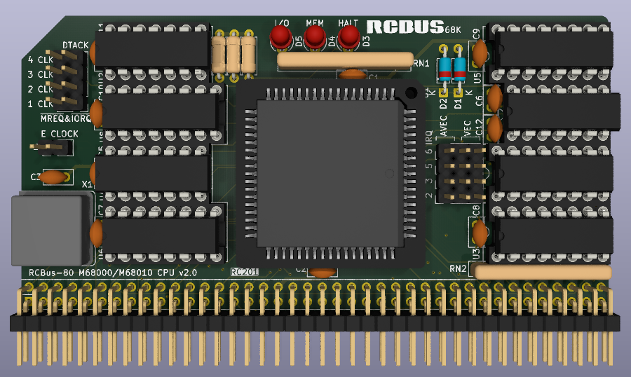

# 68000 Processor Board (Series 2)

Still at the prototyping stage so just a 3D render at the moment.

# Details
This is a 3D render of my newer 68000 CPU board that will hopefully support a mixture of vectored and autovectored interrupts. I've redesigned it to avoid the use of a CPLD and will shortly be sending the board files off to JLCPCB.

This is very much a prototype at the moment and I need to see if it is actually works in practice.

