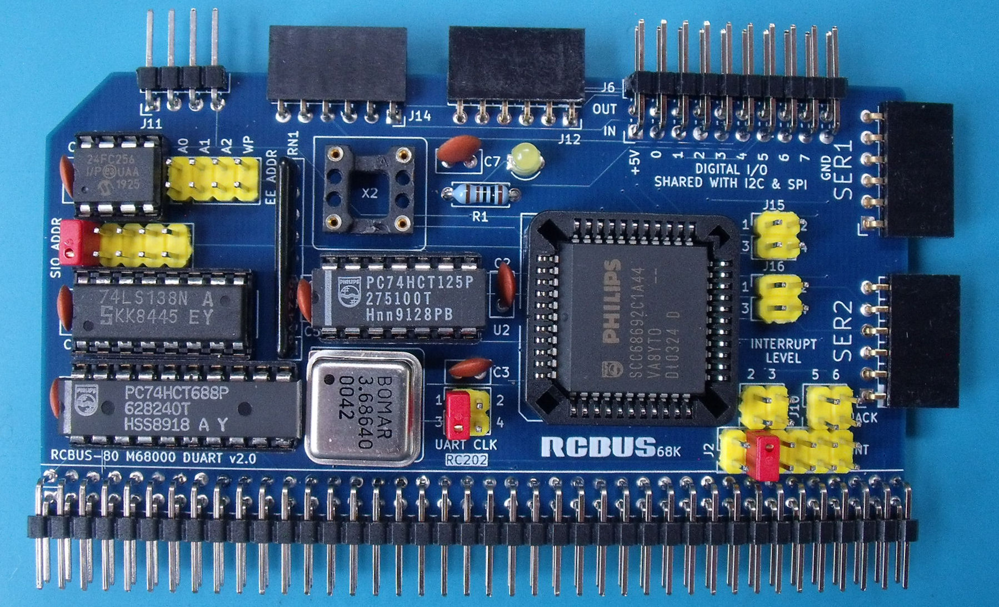

# 68692 Serial I/O Board (Series 2)

Image of the RC202 serial I/O board during testing.

# Details
The serial I/O board consists of a PLCC packaged Philips SCC68692 DUART, 3 discrete logic ICs and an I2C EEPROM. In addition to the 2 UARTs, the board also provides a bit-banged I2C interface and a bit-banged SPI interface with 2 SPI ports.

The SCC68692 DUART is compatible with MC68681 but supports up to 115200 baud via a test mode. The test mode is documented in the Philips Semiconductors document titled "Extended baud rates for SCN2681, SCN68681, SCC2691, SCC2692, SCC68681 and SCC2698B".

The 2 serial ports are each fed to a 6-pin connector at the board edge. The layout of the 6 pins is compatible with an FTDI USB-TTL Serial interface board.

The 2 SPI ports are each fed to a 6-pin connector at the board edge. The layout of the 6 pins on both connectors is compatible with the layout of the SPI pins on a readily available Micro-SD card adapter (GND, VCC, MISO, MOSI, SCK & /CS).

**NOTE:** If using the readily available Micro-SD card adapter, then it is suggested that it is fitted to SPI port #1 as SPI port #1 uses a spare gate of the 74LS125 to isolate the MISO signal when not chip selected. 

The I2C port is fed to a 4-pin connector at the board edge and the layout of the pins is compatible with Steve Cousins SC4xx series of I2C modules.

## Address Decoding
The address decoding is carried out by a 74LS688 combined with a 74LS138 to generate 5 separate 2048 byte blocks residing between addresses $D00000 and $D027FF.

The base address of the DUART is determined by the placement of a jumper between adjacent pins on J7 & J8.

## Device Register Access
The registers of the 68681 DUART are 8 bits wide and are accessed on consecutive ODD addresses from the base address set by the address decode logic. Assuming that the /CS0 jumper has been fitted, then the first few registers are accessed on the following addresses:
+ $D00001 : Mode Register A (R/W)
+ $D00003 : Status Register A (R) / Clock Select Register A (W)
+ $D00005 : Command Register A (W)

## DTACK
The DUART generates its own /DTACK signal internally which is then routed back to the processor via RCBus-80 pin 62.

## Interrupts
The board design supports autovectored interrupt generation at levels 1,2,3,4,5 or 6 depending on the placement of a jumper on J2. The RC201 processor card must also be configured to support autovectored interrupts at the same interrupt level.

The board also supports vectored interrupts at levels 2,3,5 & 6 by placing a jumper on the appropriate pins of either J9 or J10. When using vectored interrupts, the same interrupt level must be set on both J2 and J9 (or J10). The RC201 processor card must also be configured to support vectored interrupts at the same interrupt level.

## Baud Rate Generator Clock
The clock signal for the baud rate generator can be sourced from the on board 3.6864MHz crystal oscillator (X1 in the schematic) or from an external clock source on the RCBus-80 CLOCK2 pin (pin 61) via the jumper J14.

The jumper J5 can also be configured to route the baud rate generator clock to the CLOCK2 pin on the RCBus-80 connector.

## Discrete Outputs
The 8 outputs from the DUART are routed to J6 on the edge of the board. J6 also provides GND and +5V signals. Note that the board **does not have** any protection built in to prevent damage to the DUART if one of these pins is mis-used.

The discrete outputs have alternate functions to support serial handshaking as well as SPI and I2C data transfers as follows:

| Output Pin | Details |
| :---- | :---- |
| OP0 | Serial #1 CTS |
| OP1 | Serial #2 CTS |
| OP2 | I2C SCL control |
| OP3 | I2C SDA control |
| OP4 | SPI #2 /CS |
| OP5 | SPI #1 /CS and USER LED |
| OP6 | SPI SCK |
| OP7 | SPI MOSI |

## Discrete Inputs
The 6 inputs to the DUART are routed to J6 on the edge of the board. J6 also provides GND and +5V signals. Note that the board **does not have** any protection built in to prevent damage to the DUART if one of these pins is mis-used.

The discrete inputs have alternate functions to support serial handshaking as well as SPI and I2C data transfers as follows:

| Input Pin | Details |
| :---- | :---- |
| IP0 | Serial #1 RTS |
| IP1 | Serial #2 RTS |
| IP2 | Alternate clock source for the DUART timer |
| IP3 | I2C SDA state |
| IP4 | SPI MISO |
| IP5 | no alternate function |

## Serial Port Flow Control
Serial hardware flow control can be achieved on each of the 2 serial ports by shorting the appropriate solder jumpers (JP1,2,3 & 4) on the rear of the board. This routes the 2 flow control signals for each serial port to an input pin and an output pin on the DUART. You may well find that only JP2 and JP4 are required to be bridged to allow the DUART to tell the host to stop transmitting. 

# Board Assembly
Assembly of the board should be fairly straightforward. There are no surface mount devices to deal with.

If you choose have a turned pin socket for the system clock, then an 8-pin DIL turned pin socket can be used. I flipped the socket over - pins pointing upwards - and easily pushed out pins 2,3,6 & 7.

When fitting the 80-pin right angle connector, initially only solder a couple of pins at opposite ends of the connector so that you can make any adjustments if the board is not vertical when fitted to the backplane.

# Jumpers
+ J2: IRQ levels 1-6
+ J3: Serial #1 port
+ J4: Serial #2 port
+ J5: Specifies the clock source for the DUART baud rate generator
  + 1-3 Use the onboard clock source
  + 1-2 Use the RCBus clock source from CLOCK2
  + 1-2 *and* 3-4: Use the onboard clock source and supply the RCBus CLOCK2 signal with the clock.
+ J6: Exposes the 8 digital outputs and 6 digital inputs of the DUART as well as GND and +5V. Note that there is **NO** input or output protection circuitry.
+ J7 & J8: IO Address selection
  + 1-1 D00000..D007FF
  + 2-2 D00800..D00FFF
  + 3-3 D01000..D017FF
  + 4-4 D01800..D01FFF
  + 5-5 D02000..D027FF
+ J9 & J10: Interrupt acknowledge level used with vectored interrupts only and should match the level on J2 when used.
+ J11: I2C bus connector
+ J12: SPI port #1
+ J13: I2C EEPROM address and write protect
  + 1-2 Set EEPROM address bit A0 low
  + 3-4 Set EEPROM address bit A1 low
  + 5-6 Set EEPROM address bit A2 low
  + 7-8 Disable EEPROM write protection
+ J14: SPI port #2
+ J15: Fit 1-2 and 3-4 to route serial port #1 TX & RX onto the RCBus-80 pins 35 & 36.
+ J16: Fit 1-2 and 3-4 to route serial port #2 TX & RX onto the RCBus-80 pins 75 & 76.

# Errors
+ J11 (the I2C connector) is slightly too close to J14 (the SPI #2 connector) creating a slight interference fit when trying to plug in one of Steve Cousins SC4xx I2C modules.
