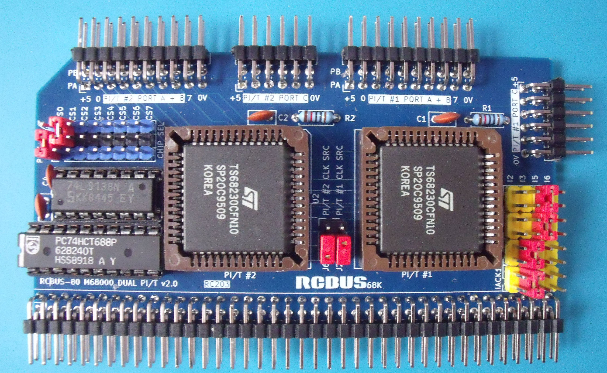

# RC203 - 68230 Parallel I/O Board

# Details
The parallel board is populated with two 68230 Parallel Interface / Timer chips. Both PI/T chips do not have to be fitted. The board will work with just one chip fitted.

## Address Decoding
The address decoding is carried out by a 74LS688 combined with a 74LS138 to generate 8 separate 2048 byte blocks residing between addresses $D08000 and $D0BFFF.

The base address of each PI/T is determined by the placement of a jumper between adjacent pins on J7 & J12 (PI/T A) and J7 & J13 (PI/T B).

## Device Register Access
The registers of the PI/T are 8 bits wide and are accessed on consecutive ODD addresses from the base address set by the address decode logic. Assuming that the /CS0 jumper has been fitted for PI/T #1, then the first few registers are accessed on the following addresses:
+ $D08001 : Port General Control Register
+ $D08003 : Port Service Request Register
+ $D08005 : Port A Data Direction Register

## DTACK
Each PI/T generates its own /DTACK signal internally which is then routed back to the processor via RCBus-80 pin 62.

**NOTE** A PI/T must have a clock present - either from the main clock source (RCBus pin 21) or the alternate CLOCK2 source (RCBus pin 61) - in order to function. The clock source for PI/T #1 is determined by the jumper position on J2 and the clock source for PI/T #2 is determined by the jumper position on J6.

**Without a clock source, the PI/T will not respond (i.e. generate a /DTACK) and a BUS ERROR will be raised by the processor card.**

## Interrupts
The board design supports autovectored interrupt generation by each PI/T at levels 2,3,5 or 6 depending on the placement of a jumper on J8 (PI/T #1) or J10 (PI/T #2). The RC201 processor card must also be configured to support autovectored interrupts at the same interrupt level.

The board also supports vectored interrupts at levels 2,3,5 & 6 depending on the placement of a jumper on J8 (PI/T #1) or J10 (PI/T #2). When using vectored interrupts, the same interrupt level must be set on both J8 and J9 (for PI/T #1) and J10 and J11 (for PI/T #2). The RC201 processor card must also be configured to support vectored interrupts at the same interrupt level.

## Input / Output Pins
The 8-bit ports A & B on each PI/T are routed to connectors along the top of the board. PI/T #1 port A and port B are present on the J1 connector along with +5V and GND. PI/T #2 port A and port B are present on the J4 connector along with +5V and GND.

The 8-bit port C on each PI/T is also routed to connectors along the top of the board. PI/T #1 port C is present on the J5 connector along with +5V and GND. PI/T #2 port C is present on the J15 connector along with +5V and GND.

Note that the board **does not have** any protection built in to prevent damage to the PI/T chips if one of these pins is mis-used.

# Board Assembly
Assembly of the board should be fairly straightforward. There are no surface mount devices to deal with.

When fitting the 80-pin right angle connector, initially only solder a couple of pins at opposite ends of the connector so that you can make any adjustments if the board is not vertical when fitted to the backplane.

# Jumpers
+ J1: PI/T #1 ports A & B plus +5V and GND
+ J2: Select RCBus CLOCK or CLOCK2 for PI/T #1 clock source - see notes above re /DTACK
+ J4: PI/T #2 ports A & B plus +5V and GND
+ J5: PI/T #1 port C plus +5V and GND
+ J6: Select RCBus CLOCK or CLOCK2 for PI/T #2 clock source - see notes above re /DTACK
+ J7: IO Address selection
  + $D08000
  + $D08800
  + $D09000
  + $D09800
  + $D0A000
  + $D0A800
  + $D0B000
  + $D0B800
+ J8: Select the interrupt level - 2,3,5 or 6 - for PI/T #1 timer interrupt
+ J9: Select the interrupt acknowledge level for PI/T #1 - used with vectored interrupts only and should match the level on J8 when used
+ J10: Select the interrupt level - 2,3,5 or 6 - for PI/T #2 timer interrupt
+ J11: Select the interrupt acknowledge level for PI/T #2 - used with vectored interrupts only and should match the level on J10 when used
+ J12: (with J7): Specify the IO Address for PI/T #1
+ J13: (with J7): Specify the IO Address for PI/T #2
+ J15: PI/T #2 port C plus +5V and GND

# Future Enhancements
Nothing yet.

# Errors
Nothing yet - but give it time :-(

# History
+ v1.0 - initial design
