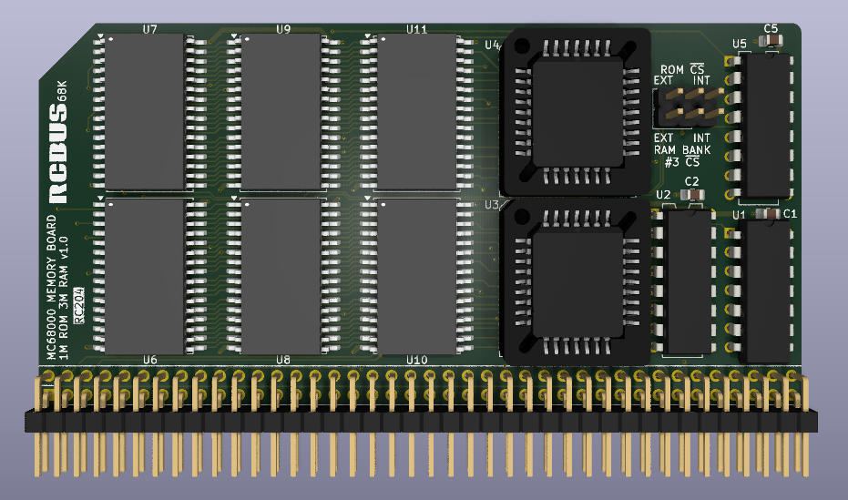

# ROM & RAM board - 1M ROM + 3M RAM

# Details
This is a 3D render of my new ROM & RAM board. It's a bit of a departure from the through hole designs as it uses SMD components to support 6 RAM chips to give a total of 3M RAM as well as 1M ROM via a pair of PLCC FLASH devices.

This is very much a prototype at the moment and I need to see if I can solder the SMD chips without shorting everything out!
  

