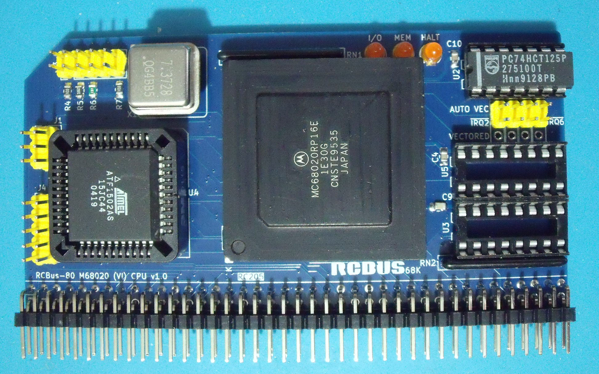

# 68020 Processor Board

There's now some real hardware!

# Details
This is my attempt at getting a 68020 processor running on RCBus. There's going to be some challenges along the way as I've not used a 68020 before. I'm also 30 years late to the CPLD world so a bit of catching up to do.

The board is built and basic operation, although not entirely successful, is showing signs that I'm on the right track. The monitor program spits out a few characters but then the board crashes so some debugging with my recently acquired [GusmanB 24 channel logic analyser](https://github.com/gusmanb/logicanalyzer/tree/master) is required to figure out what I may have done wrong. However, I suspect that it's a timing problem.
