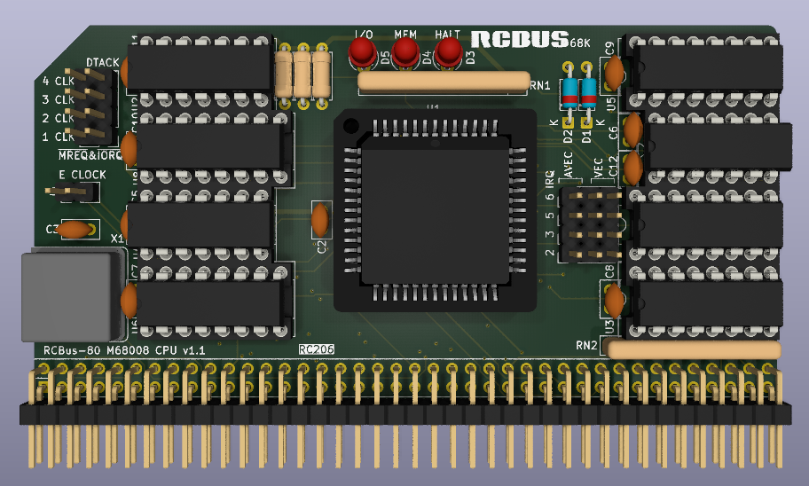

# 68008 Processor Board (Series 2)

Still at the prototyping stage so just a 3D render at the moment.

# Details
This is a 3D render of a 68008 CPU board that I quickly designed based on my RC201 68000 board. I had an order going in to JLCPCB and figured I would throw this one in as a bit of an extra!

This is very much a prototype at the moment and I need to see if it is actually works in practice.

