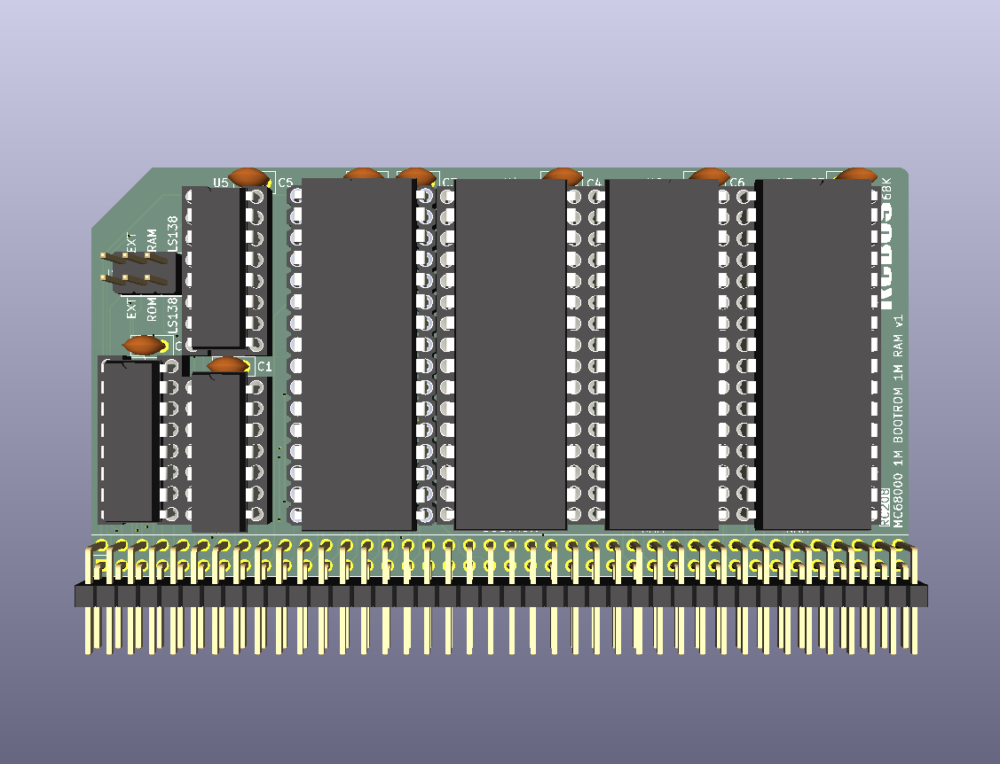
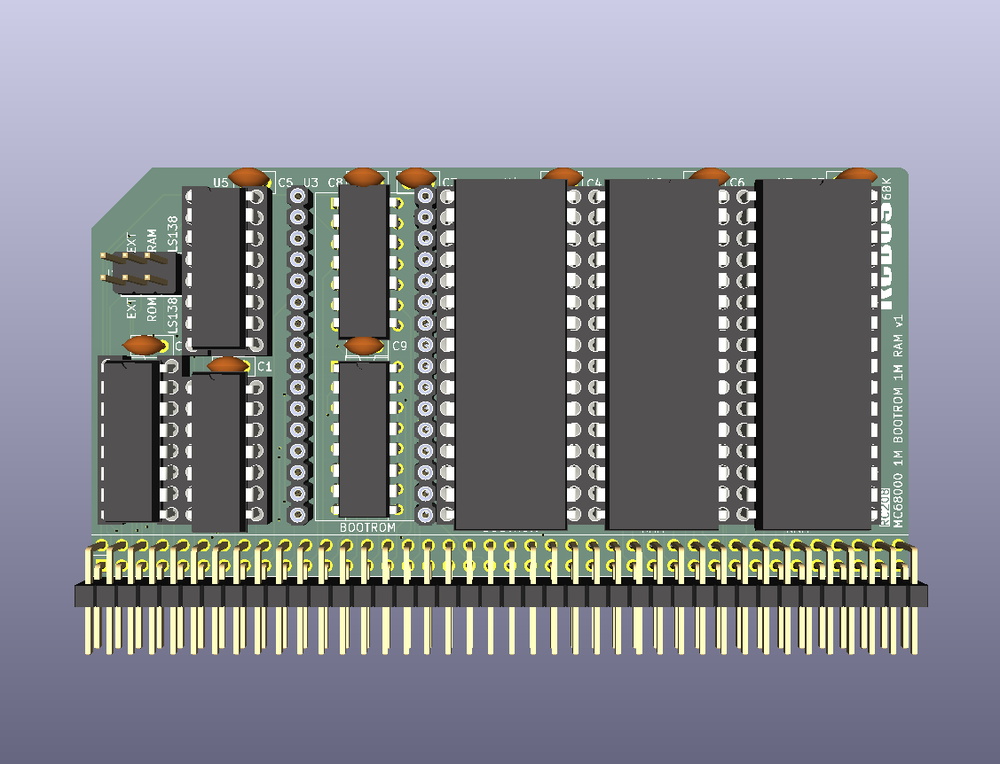

# BOOT ROM & RAM board - 1M ROM + 1M RAM

The additional 2 chips hidden under one of the ROMs.

# Details
This is a 3D render of my new BOOT ROM & RAM board. It is almost identical to my RC107 board with a couple of exceptions.

I'm experimenting with moving the BOOT ROM so that RAM can be located at address 0x000000. This board places the ROMs at address 0x000000 at reset. The ROMs stay mapped to this address for the first 4 address strobes after a reset and then automatically get mapped to addresses 0x700000..0x7FFFFF and the RAMs become available at addresses 0x000000..0x0FFFFF until the next reset. 

This memory board should automatically remap the memory chips.

This is very much a prototype at the moment and I need to see if the manual write works or causes issues.
  

