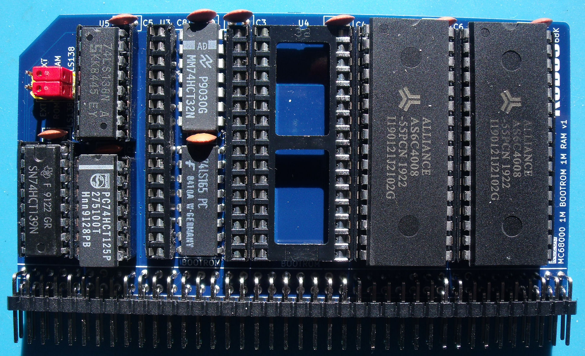

# 1M BOOT ROM & 1M RAM board - v1.1

The old v1.0 board with the flash chips removed.

# Details
This is my RC208 BOOT ROM & RAM board and it is designed to plug into an RCBus-80 backplane with support for 1M ROM (via 2x SST39SF040 FLASH chips) and 1M RAM (via 2x Alliance Memory AS6C4008 SRAMs). The FLASH chips and SRAMs are used as a pair to allow 16-bit wide memory accesses.

This board is an enhanced version of my earlier RC107 board. This board presents the flash memory at address 0x000000 at reset and disables access to the RAM. After 4 address strobes, the flash memory is automatically moved up to address 0x700000 and the RAM becomes available at address 0x000000.

## Address Decoding
The address decoding is carried out by a 74LS138 and divides the lower 8Mb of memory space into eight 1Mb blocks.

After reset, the 74LS165 sets its Q7 output to a '1'. This '1' is then OR'd with address lines A20, A21 and A22 using 3 OR gates of the 74LS32 forcing their outputs to be a '1'. The outputs of the 3 OR gates are then fed into the A0, A1 and A2 inputs of the 74LS138 which forces output O7 of the 74LS138 low selecting the ROMs.

**68000**: After 4 address strobes, the 68000 has read the initial stack pointer and initial program counter from the ROMs and Q7 of the 74LS165 goes to a '0' allowing the outputs of the 3 OR gates to follow the logic levels on A20, A21 and A22. The 74LS138 then selects the RAM for any address between 0x000000..0x0FFFFF and the ROM for any address between 0x700000..0x7FFFFF.

**68008**: After 8 address strobes, the 68008 has read the initial stack pointer and initial program counter from the ROMs and Q7 of the 74LS165 goes to a '0' allowing the outputs of the 3 OR gates to follow the logic levels on A20, A21 and A22. The 74LS138 then selects the RAM for any address between 0x000000..0x0FFFFF and the ROM for any address between 0x700000..0x7FFFFF.

**Note:** If this board is used with an MC68302 processor, then see the note further down regarding the ability to externally remap the ROM & RAM devices.

## Bus Width 
A 74LS139 generates the read and write signals for each of the memory chips and takes care of byte or word accesses.

## DTACK
A 74LS125 is used to generate a simple /DTACK signal driven directly from the EEPROM and SRAM chip select signals without any wait period.

# Board Assembly
Assembly of the board should be fairly straightforward as there are no surface mount devices to deal with. All ICs are socketed except the 74LS32 and the 74LS165 which are soldered directly into the board.

The only tricky bit is the cutting of one of the 32-pin DIL sockets to remove the horizontal spacers.

When fitting the 80-pin right angle connector, initially only solder a couple of pins at opposite ends of the connector so that you can make any adjustments if the board is not vertical when fitted to the backplane.

Note the ROMs must be fitted to U3 and U4 in order for the processor to boot correctly.

Finally, set JP1 and J2 for your specific configuration (see below).

# MC68302 ROM & RAM Remapping

If the version of my MC68302 monitor is used that can remap the /CS0 and /CS1 chip select signals, then U1 (74LS125), U5 (74LS138), U8 (74LS165) and U9 (74LS32) are not required but can be fitted if the board is also going to be used with a 68000 or 68010 processor later.

Remember to set JP1 accordingly!

# Jumpers
+ J1 - Chip Selects
  + On board chip selects: jumper ROM-LS138 & RAM-LS138
  + External Chip Selects: jumper ROM-EXT & RAM-EXT
+ JP1 - /AS counter
  + 68000/68010: Solder pads 2-3
  + 68008: Solder pads 1-2

# Errors
None so far.

# History
v1.1 - rear silkscreen correction for JP1
v1.0 - initial design