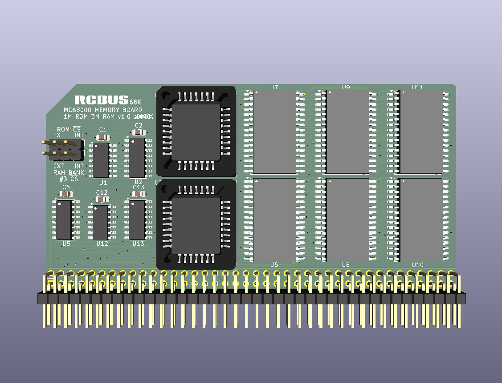

# BOOT ROM & RAM board - 1M ROM + 3M RAM

# Details
This is a 3D render of my new BOOT ROM & RAM board. It is almost identical to my RC204 board but incorporates the same automatic BOOT ROM switching that my RC208 board uses.

The ROMs are at address 0x000000 at reset. The ROMs stay mapped to this address for the first 4 address strobes after a reset and then automatically get mapped to address 0x700000 and the RAMs become available at addresses 0x000000..0x0FFFFF, 0x100000..0x1FFFFF and 0x200000..0x2FFFFF until the next reset. 

This memory board should automatically remap the memory chips.

This is very much a prototype at the moment and I need to see if my SMD soldering is up to the task!
  

