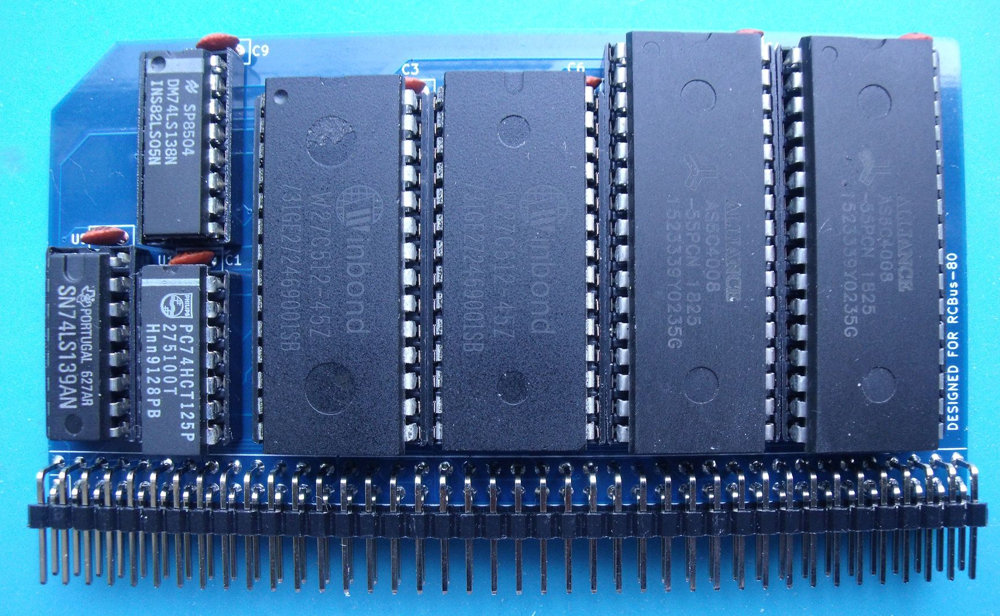
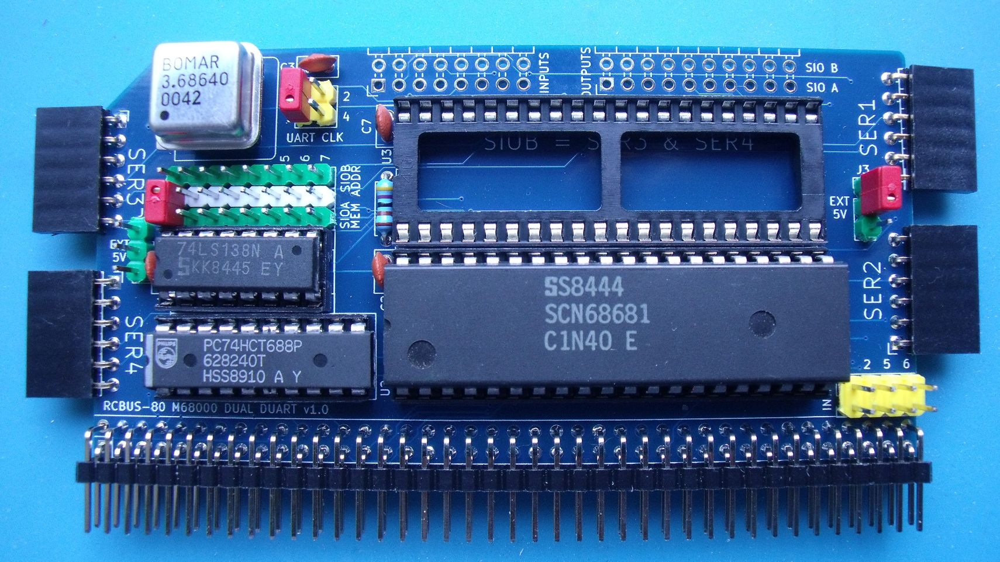
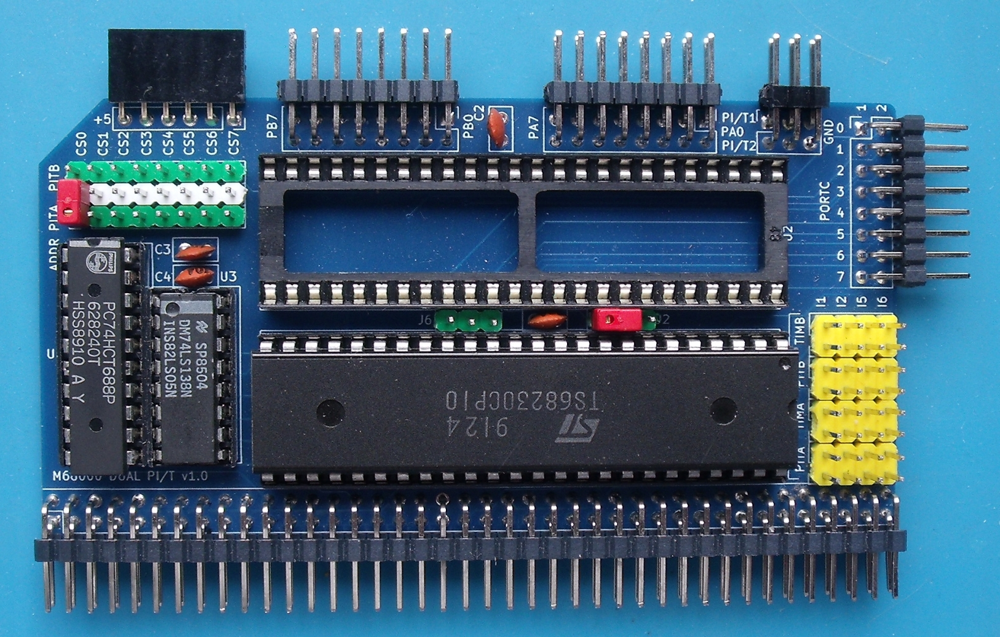
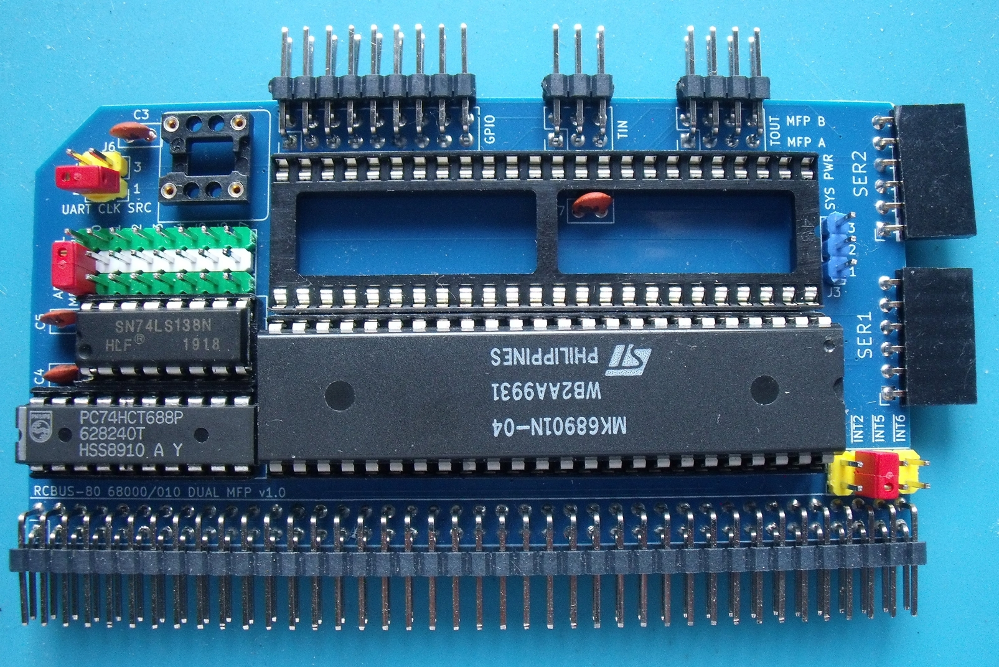
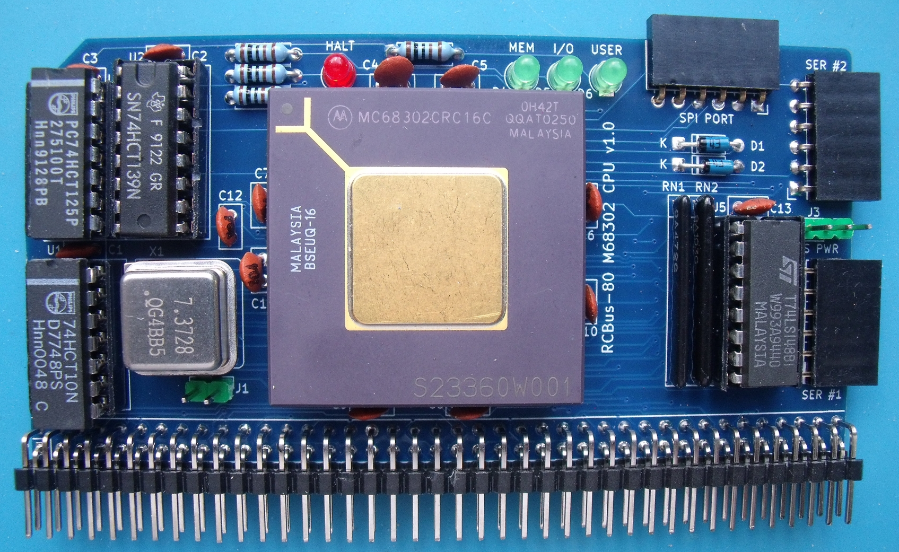
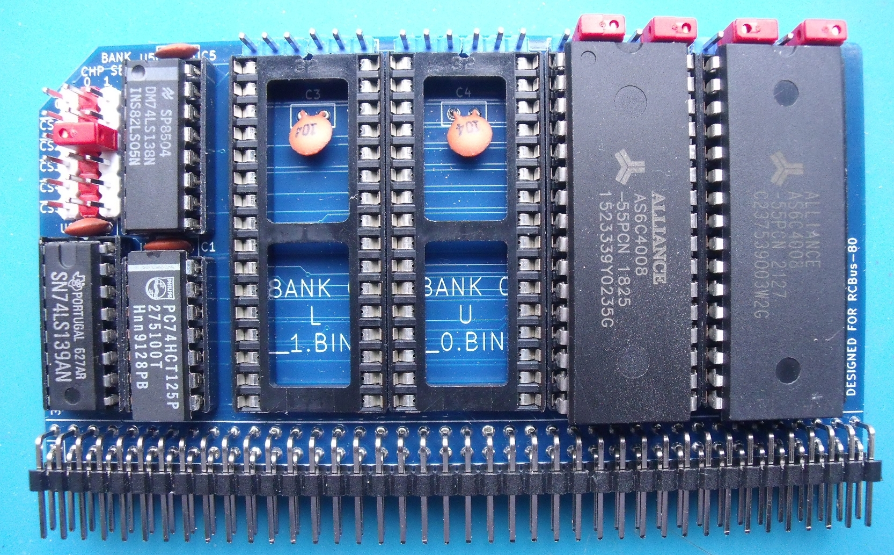

# RCBUS-68000-Boards

These folders contain the KiCad (v8/v9) design files for the various RCBus 68000 boards I'm currently testing.

| Board Folder | Description |
| :---- | :---- |
| [68000 CPU Board](#68000-Processor-Board) | 68000 processor card using the PLCC package variant of the 68000 |
| [68000 ROM RAM_Board](#ROM-RAM-Board-v1) | 128K ROM & 1M RAM board |
| [68000 ROM/RAM Board v2](#ROM-RAM-Board-v2) | 1M ROM & 1M RAM board |
| [68000 SIO Board](#Serial-IO-Board) | Dual MC68681 serial board - 4 serial ports |
| [68000 MFP Board](#Multifunction-Board) | Dual MC68901 multifunction peripheral board |
| [68000 PIO Board](#Parallel-IO-Board) | Dual MC68230 parallel interface / timer board |
| [68302 CPU Board](#68302-Processor-Board) | 68302 processor card using the PGA package |

Make sure to look at the readme.txt files in each board folder as they will detail any errors and corrections I've noticed so far as well as any thoughts on future enhancements etc.

---

# Boards

## 68000 Processor Board

The processor board consists of a PLCC packaged MC68000 processor, bits of glue logic and the processor clock source.

### Clocks
The processor/system clock source is an oscillator in an 8-pin DIL/DIP can. I used a turned pin socket to hold the oscillator as it made it easy to quickly swap in and out oscillators of different frequencies.

There's also a jumper to allow the processor E clock to be routed onto the RCBus CLOCK2 pin (61) if required.

Note that the CLOCK2 pin may also be used by the serial, parallel and multifunction boards (via jumpers on their boards) to share a clock source between them - usually to feed the baud rate generators and timers. If this feature is used, then the E clock jumper must not be fitted.

### DTACK & Bus Error
The processor board includes a counter to generate a bus error if a DTACK is not received after 4 clocks of the E signal.

The processor board also includes a counter to generate a DTACK for the RCBus MREQ and IORQ addresses. The DTACK delay can currently be set to 1, 2, 3 or 4 system clocks.

Only RCBus MREQ and IORQ accesses generate a DTACK. All other boards must supply their own DTACK signal otherwise a bus error will be raised.

### RCBus Signals
The RCBus specification (v1.0) doesn't specifically mention the 68000 in the backplane signal assignments table so there's a bit of wiggle room on the pins used.

I've stuck to the same signals for pins 1-40. The M1 signal isn't used and should have a 4K7 pullup resistor (manually added as I forgot it in my release 2.0 board!) and the USER1..USER4 which are used for the level 1, 3, 5 & 6 autovector interrupts.

Pins 41-80 carry D8..D15 as well as the higher address bits. Pins 41..44 have been used to carry some 68000 specific signals.

The current signal list is in the [RCBus 68000 Pinout](../RCBus-68000-Pinout.pdf) PDF file.

### RCBus memory space
My 68000 design partially decodes 2 blocks of memory within the 68000 address range as follows:
| Address Range | Signal |
| :---- | :---- |
| 0xF00000..0xF7FFFF | /MREQ goes low |
| 0xF80000..0xFFFFFF | /IORQ goes low |

This partial decoding results in the RCBus I/O and memory spaces appearing multiple times within the 68000 address range. A /DTACK signal is generated on the processor card for any access to the RCBus whether there is a device present at that address or not.

For both I/O and memory spaces, consecutive memory locations are accessed on the ODD bytes such that I/O address 0x00 is accessed at address 0xF80001, address 0x01 is accessed at address 0xF80003 etc.

### Onboard LEDs

There were a few gates left over and I've used them to drive activity LEDs for accesses to the RCBus I/O and memory spaces as well as a HALT LED.

---

## ROM RAM Board v1

The ROM/RAM board uses 2x Winbond W27C512 EEPROMs to provide 128K of non-volatile memory organised as 64K of 16-bit wide memory. It also uses 2x Alliance Memory AS6C4008 RAM chips to provide 1M of volatile memory organised as 512K of 16-bit wide memory.
 
The ROM/RAM board decodes memory into 1Mb blocks and is hard configured such that the ROM starts at address $000000 and the RAM starts at address $100000.

A possible future modification is to redesign the board to support 512K FLASH chips instead of the 64K EEPROMs and if possible, the option of being able to configure the board for 4 RAM chips allowing an additional 2M of RAM to be fitted. **SEE ROM/RAM board V2 below.**

---

## Serial IO Board

The serial board is populated with two 68681 (or equivalent) DUARTS giving 4 UARTs in total. Each DUART can reside at one of 8 selectable 2K memory addresses from $D00000 to $D03FFF.

The board also includes an oscillator in an 8-pin DIL/DIP can to feed the baud rate generator. This clock can be shared with other boards by configuring the jumpers appropriately.

The current design combines the interrupts from both DUARTs and can route the interrupt to one of the autovector interrupts INT1, INT2, INT5 or INT6 via jumper selection.

---
 
## Parallel IO Board

The parallel I/O board is populated with two 68230 (or equivalent) PI/T (Parallel Interface/Timers). Each PI/T can reside at one of 8 selectable 2K memory addresses from $D08000 to $D0BFFF.

Each PI/T can generate a timer interrupt and a port interrupt. These can be individually configured route to one of the autovector interrupts INT1, INT2, INT5 or INT6 via jumper selection.

The clock source for each PI/T can be selected from either CLOCK or CLOCK2 on the RCBus via jumper selection.

**NOTE:** The 68230 chip must have a clock signal present on pin 40 (CLK) even if the timer is not being used. Without a clock signal, the 68230 will not generate a /DTACK and the processor will throw a bus error. 
 
---

## Multifunction Board

The multifunction peripheral board is populated with two 68901 (or equivalent). Each MFP can reside at one of 8 selectable 2K memory addresses from $D10000 to $D13FFF.

The board also includes an oscillator in an 8-pin DIL/DIP can to feed the baud rate generator and timers. This clock can be shared with other boards by configuring the jumpers appropriately.

The current design combines the interrupts from both MFPs and can route the interrupt to one of the autovector interrupts INT1, INT2, INT5 or INT6 via jumper selection.

---

## 68302 Processor Board

The 68302 processor board consists of a PGA packaged MC68302 processor, bits of glue logic and the processor clock source.

### Clocks
The processor/system clock source is an oscillator in an 8-pin DIL/DIP can. I used a turned pin socket to hold the oscillator as it made it easy to quickly swap in and out oscillators of different frequencies.

The 68302 doesn't have an E clock signal like the 68000 does so I chose to have the option to route the output of Timer #1 to the RCBus CLOCK2 pin (61) via a jumper.

Note that the CLOCK2 pin may also be used by the serial, parallel and multifunction boards (via jumpers on their boards) to share a clock source between them - usually to feed the baud rate generators and timers. If this feature is used, then the CLOCK2 jumper must not be fitted.

### Chip Selects
The 68302 processor has 4 user programmable chip select signals - CS0, CS1, CS2 & CS3.

CS0 is automatically configured by the processor at reset for an 8K block of memory starting at address $000000. CS0 would normally be used to select a non-volatile memory device that holds the boot code. My ROM/RAM board includes address decoding to select the pair of ROMs at address $000000 so CS0 isn't needed. However there's a solder jumper that can be used to routine it to RCBus pin 45 if required.

CS1 is disabled by the processor at reset. I intended this chip select to select the volatile memory device on my ROM/RAM board, but as the board includes address decoding to select the pair of RAMs at address $100000, CS1 isn't needed. However there's a solder jumper that can be used to routine it to RCBus pin 46 if required.

CS2 is disabled by the processor at reset. This chip select signal is used to enable access to the RCBus memory and i/o spaces. The CS2 address decoding is configured for a 128K block of memory that is split into 2 64K blocks by half of a 74LS139. Accessing the lower 64K block generates an /MREQ on the RCBus and accessing the upper 64K block generates an /IORQ on the RCBus. 
 
### DTACK & Bus Error
The user programmable chip select signals can also be configured to internally generate the DTACK signal so no external gates are required. My ROM/RAM board generates its own DTACK signal so DTACK is disabled for CS0 & CS1. CS2 is configured to for 2 wait states.

The 68302 processor also includes an internal hardware watchdog that is enabled at reset and will generate a Bus Error if a DTACK isn't generated by the internal chip select logic or an external device.

### RCBus Signals
I've stuck to the same signals as used on my 68000 board but with the option of routing CS0 (pin 45) and CS1 (pin 46) to the RCBus connector. The current signal list is in the [RCBus 68000 Pinout](../RCBus-68000-Pinout.pdf) PDF file.

The output of Timer #1 can be routed to the CLOCK2 pin to provide a clock source for other boards if required.

### RCBus memory space
The RCBus memory space is available via a 128K window in the 68302 address space. The hardware uses CS2 to select this memory space with A16 determining either memoru or i/o space as follows:
| Address Range | Signal |
| :---- | :---- |
| 0xFC0000..0xFCFFFF | /MREQ goes low |
| 0xFD0000..0xFDFFFF | /IORQ goes low |

This partial decoding results in the RCBus I/O memory space appearing multiple times within the 68000 address range. A DTACK signal is generated internally for any access to the RCBus whether there is a device present at that address or not.

For both I/O and memory spaces, consecutive memory locations are accessed on the ODD bytes such that I/O address 0x00 is accessed at address 0xFD0001, address 0x01 is accessed at address 0xFD0003 etc.

### Onboard LEDs

There were a few gates left over and I've used them to drive activity LEDs for accesses to the RCBus I/O and memory spaces as well as a HALT LED and a user LED connected to port pin PB9.

---

## ROM RAM Board v2

This ROM/RAM board is a bit of an upgrade from the earlier ROM & RAM board. It has 4x 32-pin sockets so that it can take 2x Alliance Memory AS6C4008 RAM chips to provide 1M of volatile memory organised as 512K of 16-bit wide memory and 2x SST39SF040 FLASH memory chips to provide 1M of non-volatile memory organised as 512K of 16-bit wide memory.

The board will also take 4x Alliance Memory AS6C4008 RAM chips for 2M of volatile memory or 4x SST39SF040 FLASH memory chips to provide 2M of non-volatile memory.

Selection of either ROM or RAM is done via standard jumpers and chips must be installed pairs as the memory is 16-bit wide.

The ROM/RAM board decodes memory into 1Mb blocks and via chip selects, the 2 banks of memory can be placed on any 1Mb boundary from $000000 to $500000.

Both v1 and v2 boards can be used in the same system - just make sure that the v2 board is using /CS2, /CS3, /CS4 or /CS5 to select the devices to avoid conflicting with the fixed address decoding of the v1 board.

---

# Chips

My processor board has a turned pin socket fitted so I can easily try different CPU clock frequencies. Initial testing was done with a 7.3728MHz oscillator but I've just tried an 18.432MHz oscillator.

I've re-un the test programs for the SC729 (CompactFlash module), SC611 (MicroSD module) and SC704 (I2C bus master module) and all appear to operate correctly.

It then occured to me that I should detail somewhere the chips that I'm using across my design in case that has a bearing on the crystal oscillator frequency on the processor board. What follows is a list of ICs I used on each board.

## 68000 Processor Board

| Chip ID | Manufacturer | Chip Number | Description |
| :---- | :---- |  :---- | :---- |
| U1 | Motorola | MC68HC000FN20 | 68000 Processor |
| U2 | Philips | PC74HCT125P | Quad tri-state buffer |
| U3 | ST | T74LS148B1 | 8 line to 3 line priority encoder |
| U4 | TI? | SN74LS10N | Triple 3-input NAND gate |
| U5 | TI | SN74LS139AN | Dual 2-line to 4-line decoder |
| U6 | TI | SN74LS175N | Quadruple D-Type flip-flop |
| U8 | TI | SN74LS175N | Quadruple D-Type flip-flop |
| U9 | TI | SN74LS00N | Quad 2-input NAND gate |

Note there isn't a U7.

## 68302 Processor Board

| Chip ID | Manufacturer | Chip Number | Description |
| :---- | :---- |  :---- | :---- |
| U1 | Phillips | 74HCT10N | Triple 3-input NAND gate |
| U2 | TI | SN74HCT139N | Dual 2-line to 4-line decoder |
| U3 | Phillips | PC74HCT125P | Quad tri-state buffer |
| U4 | Motorola | MC68302CRC16C0 | 68302 Processor |
| U5 | ST | T74LS148B1 | 8 line to 3 line priority encoder |

## ROM / RAM Board v1

| Chip ID | Manufacturer | Chip Number | Description |
| :---- | :---- |  :---- | :---- |
| U1 | Phillips | PC74HCT125P | Quad tri-state buffer |
| U3 | Winbond | W27C512-45Z | 64K x 8 EEPROM |
| U4 | Alliance Memory | AS6C4008-55PCN | 512K x 8 SRAM |
| U5 | Alliance Memory | AS6C4008-55PCN | 512K x 8 SRAM |
| U6 | Winbond | W27C512-45Z | 64K x 8 EEPROM |
| U8 | Nat Semi | DM74LS138N | 3 to 8 line decoder |
| U9 | TI | SN74LS139AN | Dual 2-line to 4-line decoder |

Note there isn't a U2 or U7 as I forgot to re-annotate the schematic.

## ROM / RAM Board v2

| Chip ID | Manufacturer | Chip Number | Description |
| :---- | :---- |  :---- | :---- |
| U1 | Phillips | PC74HCT125P | Quad tri-state buffer |
| U2 | TI | SN74LS139AN | Dual 2-line to 4-line decoder |
| U3 & U4 | | See Note | Either a pair of ROMs or a pair of RAM chips |
| U5 | Nat Semi | DM74LS138N | 3 to 8 line decoder |
| U6 & U7 | | See Note | Either a pair of ROMs or a pair of RAM chips |

The board was designed around Alliance Memory AS6C4008 512K RAM chips and SST 39SF040 512K flash chips. As long as they are 32-pin devices they will likely work but check the pinouts just in case! 

## Serial I/O Board

| Chip ID | Manufacturer | Chip Number | Description |
| :---- | :---- |  :---- | :---- |
| U1 | ?? | 74LS138N | 3 to 8 line decoder |
| U2 | Philips | SCN68681 | Dual Universal Asynchronous Receiver/Transmitter |
| U3 | Philips | SCN68681 | Dual Universal Asynchronous Receiver/Transmitter |
| U4 | Philips | PC74HCT688P | 8 bit magnitude comparator |

## Parallel I/O Board

| Chip ID | Manufacturer | Chip Number | Description |
| :---- | :---- |  :---- | :---- |
| U1 | ST | TS68230CP10 | Parallel Interface / Timer |
| U2 | ST | TS68230CP10 | Parallel Interface / Timer |
| U3 | Nat Semi | DM74LS138N | 3 to 8 line decoder |
| U4 | Philips | PC74HCT688P | 8 bit magnitude comparator |

## Multi-Function Peripheral Board

| Chip ID | Manufacturer | Chip Number | Description |
| :---- | :---- |  :---- | :---- |
| U2 | ?? | SN4LS138N | 3 to 8 line decoder |
| U4 | ST | MK68901N-04 | Multi-Function Peripheral |
| U5 | ST | MK68901N-04 | Multi-Function Peripheral |
| U6 | Philips | PC74HCT688P | 8 bit magnitude comparator |

Note there isn't a U1 or U3 as I forgot to re-annotate the schematic.

